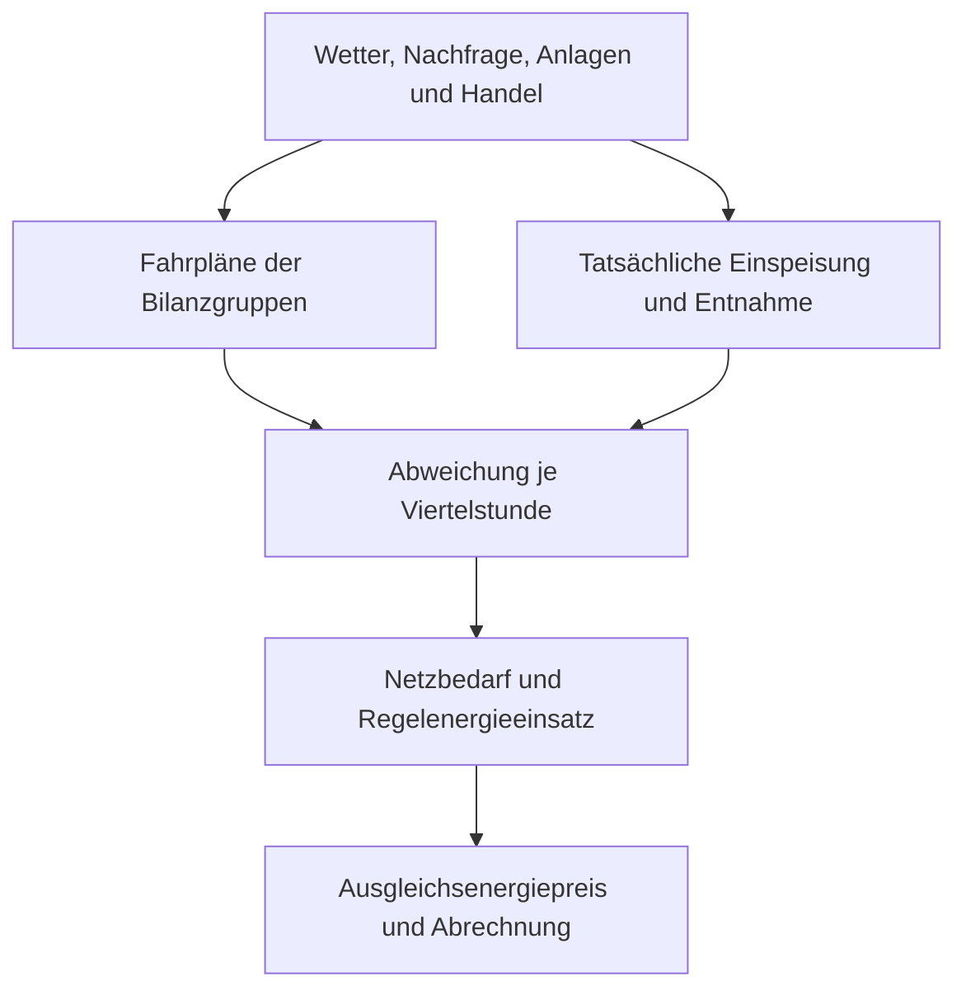

# Balance Energy Price Prediction Challenge – Ausgangslage und Wiki

> **Kernfrage:** Wie lassen sich die schweizerischen Ausgleichsenergiepreise für künftige Viertelstunden in beiden Bilanzabweichungsrichtungen nachvollziehbar vorhersagen, und wie gross ist die Unsicherheit jeder Prognose?
> **Wichtige Abgrenzung:** Die hochgeladene Swissgrid-XML für Mai 2026 enthält **eine** Preisreihe `BG-AEP` in Euro-Cent/kWh, keine zwei getrennten Zielspalten. „Positive/negative Ausgleichsenergie“ meint zunächst die Richtung der Mengenabweichung, sie ist nicht gleichbedeutend mit einem positiven/negativen *Zahlenwert* des Preises. Die genaue Zielvariable und die ab 2026 geltende Abrechnungslogik sind vor der Modellierung anhand der aktuellen Swissgrid-Regeln zu operationalisieren.

## Navigation

1. [Ausgangslage und Ziel](#1-ausgangslage-und-ziel)
2. [Wiki der wichtigsten Begriffe](#2-wiki-der-wichtigsten-begriffe)
3. [Vom Fahrplan zur Abrechnung](#3-vom-fahrplan-zur-abrechnung)
4. [Wie die verschiedenen Preise entstehen](#4-wie-die-verschiedenen-preise-entstehen)
5. [Wer wem bezahlt](#5-wer-wem-bezahlt)
6. [Stakeholder und Interessen](#6-stakeholder-und-interessen)
7. [Einflussgrössen und entscheidende Parameter](#7-einflussgrössen-und-entscheidende-parameter)
8. [Forschungsfragen und Modellkonzept](#8-forschungsfragen-und-modellkonzept)
9. [Datenlage, Fallstricke und offene Entscheidungen](#9-datenlage-fallstricke-und-offene-entscheidungen)
10. [Quellen](#10-quellen)

## 1. Ausgangslage und Ziel

Stromproduktion und Verbrauch müssen laufend zusammenpassen. Im Voraus erstellen Marktteilnehmer Prognosen und handeln Energie. In der Lieferzeit weichen tatsächliche Einspeisung und Entnahme dennoch vom Plan ab: Wolken verändern die Photovoltaikproduktion, der Verbrauch überrascht, ein Kraftwerk fällt aus. Swissgrid hält die Netzfrequenz stabil, indem sie bei Bedarf flexible Anlagen aktiviert. Anschliessend werden die Abweichungen der Bilanzgruppen mit Ausgleichsenergiepreisen abgerechnet. Swissgrid beschreibt seit 2026 zusätzlich einen Anreiz: Bilanzgruppen, deren Abweichung das Gesamtnetz stabilisiert, erhalten Geld, destabilisierende Bilanzgruppen zahlen. Die konkrete Rechnung hängt von Mengenrichtung, Systemzustand, Preisvorzeichen und gültiger Regel ab. [S1]

**Auftrag laut CDS1-Beschreibung:** Ein Modell soll künftige Schweizer Ausgleichsenergiepreise für positive und negative Ausgleichsenergie quantifizieren, pro Prognose ein Konfidenz- beziehungsweise Unsicherheitsmass liefern und Entscheidungen fachlich begründen. Gefragt sind auch Muster, Feiertagseffekte, Anomalien, Korrelationen und die Einordnung der Ergebnisse. Ergebnis: öffentlich dokumentiertes GitHub-Repository und Präsentation mit Verteidigung. Die Modellmethode ist Mittel zum Zweck. Domänenverständnis und nachvollziehbare Reflexion sind ausdrücklich zentral. [A1]

**Warum die Vorhersage schwierig ist:** Preisbildung hängt von Prognosefehlern, Netzlage, tatsächlich aktivierten Reserven, Marktpreisen und regulatorischer Abrechnungsformel ab. Mehrere Grössen werden erst während oder nach der Zielviertelstunde bekannt. Seltene Extremsituationen können die Fehler stärker prägen als normale Stunden.

### Das System in einem Bild

*Vereinfachung:* Die Preisformel verarbeitet zusätzliche Markt- und Regelparameter. Eine einzelne Bilanzgruppe bestimmt den Systempreis nicht allein.

## 2. Wiki der wichtigsten Begriffe

| Begriff                                  | Kurz erklärt                                                                                                                  | Bedeutung für die Challenge                                                                                           |
| ---------------------------------------- | ----------------------------------------------------------------------------------------------------------------------------- | --------------------------------------------------------------------------------------------------------------------- |
| **Leistung (MW)**                        | Momentane Einspeise- oder Entnahmerate.                                                                                       | Beschreibt die Höhe eines momentanen Systemungleichgewichts oder die verfügbare Reserve.                              |
| **Energie (MWh/kWh)**                    | Leistung über eine Zeitdauer integriert: 1 MW während 15 Minuten = 0,25 MWh.                                                  | Abweichungsmengen und Abrechnung beruhen auf Energie.                                                                 |
| **Regelzone Schweiz**                    | Gebiet, dessen Systemgleichgewicht Swissgrid als Übertragungsnetzbetreiberin steuert.                                         | Räumlicher Bezug des Zielpreises.                                                                                     |
| **Bilanzgruppe (BG)**                    | Rechnerische Zusammenfassung von Einspeisungen, Entnahmen und Handelspositionen.                                              | Ihre gemessene Abweichung wird abgerechnet.                                                                           |
| **Bilanzgruppenverantwortliche (BGV)**   | Verantwortliche für Planung und Ausgleich der Positionen ihrer Bilanzgruppe.                                                  | Direkte Vertrags- und Abrechnungsseite gegenüber Swissgrid.                                                           |
| **Fahrplan**                             | Gemeldete geplante Energieposition für eine Lieferperiode.                                                                    | Ausgangspunkt des Vergleichs mit tatsächlichen Mengen.                                                                |
| **Bilanzabweichung / Imbalance**         | Differenz zwischen tatsächlicher und geplanter BG-Position.                                                                   | Menge, auf die die Ausgleichsenergieabrechnung angewandt wird.                                                        |
| **Positive BG-Abweichung**               | In dieser Übersicht: BG hat netto *mehr* eingespeist beziehungsweise *weniger* entnommen als geplant.                         | Kann ein knappes System entlasten, ein überschüssiges System belasten. Vorzeichenkonvention der Originaldaten prüfen. |
| **Negative BG-Abweichung**               | BG hat netto *weniger* eingespeist beziehungsweise *mehr* entnommen als geplant.                                              | Kann ein knappes System verschärfen, ein überschüssiges System entlasten.                                             |
| **Systembilanz**                         | Gesamtsaldo der Regelzone. Sagt, ob im System Strom fehlt oder überschüssig ist.                                              | Entscheidet mit, ob eine BG-Abweichung hilft oder schadet.                                                            |
| **Regelleistung / Reservekapazität**     | Vorab bereitgehaltene flexible Leistung.                                                                                      | Vorhaltung verursacht Kosten, selbst ohne Aktivierung.                                                                |
| **Regelenergie**                         | Tatsächlich abgerufene Energie aus flexiblen Ressourcen.                                                                      | Dient dem physischen Ausgleich: Ihre Beschaffung ist nicht dasselbe wie die BG-Abrechnung.                            |
| **Positive / negative Regelenergie**     | Vereinfacht: positive Regelenergie erhöht Einspeisung oder senkt Verbrauch. Negative senkt Einspeisung oder erhöht Verbrauch. | Nicht mit positivem/negativem *Preiswert* verwechseln.                                                                |
| **PRL / SRL / TRL**                      | Primär-, Sekundär- und Tertiärregelreserven mit unterschiedlicher Reaktionszeit.                                              | Unterschiedliche Produkte und Aktivierungen können den Ausgleich beeinflussen. [S1]                                   |
| **Ausgleichsenergie (AE)**               | Abgerechnete Energieabweichung einer Bilanzgruppe gegenüber dem Fahrplan.                                                     | Eigentlicher Gegenstand der Challenge.                                                                                |
| **Ausgleichsenergiepreis (AEP)**         | Preis je Abweichungsenergieeinheit nach der jeweils gültigen Swissgrid-Methodik.                                              | Zielgrösse: Kann als Zahl auch negativ sein.                                                                          |
| **Day-Ahead / Intraday**                 | Stromhandel für den nächsten Tag beziehungsweise kurzfristige Anpassungen vor Lieferung.                                      | Marktpreise und Handelsanreize, aber kein Ersatz für den AEP.                                                         |
| **Netznutzung / Systemdienstleistungen** | Tarife für Netzinfrastruktur und bestimmte Leistungen zur sicheren Netzführung.                                               | Gehören zum Endkundentarif, nicht mit AEP gleichsetzen.                                                               |
| **Prognosehorizont**                     | Abstand zwischen Ausgabe einer Vorhersage und der vorhergesagten Viertelstunde.                                               | Legt fest, welche Daten zum Prognosezeitpunkt wirklich verfügbar sind.                                                |
| **Prädiktionsintervall**                 | Bereich, der einen künftigen Einzelpreis mit angegebener Zielabdeckung enthalten soll.                                        | Praktisches Unsicherheitsmass, das auf Kalibrierung geprüft werden muss.                                              |

## 3. Vom Fahrplan zur Abrechnung

1. **Planung:** BGV prognostizieren Produktion und Verbrauch und melden beziehungsweise handeln geplante Positionen. Day-Ahead- und Intraday-Handel können Positionen bis nahe an die Lieferung anpassen. [S1, A2]
2. **Lieferung:** Reale Einspeisung und Entnahme ergeben je Viertelstunde eine BG-Abweichung. Die Summe aller Abweichungen, Netzflüsse und Messwerte prägt den Systemzustand.
3. **Physischer Ausgleich:** Swissgrid aktiviert bei Bedarf positive oder negative Regelenergie von dafür qualifizierten Anbietern. Diese erhalten je nach Produkt Vergütung für Vorhaltung und/oder Abruf. [S1]
4. **Preisermittlung:** Die gültige AEP-Methodik übersetzt Markt-, Aktivierungs- und Systeminformationen in Abrechnungspreise. Swissgrid veröffentlicht die Preisdaten monatlich. [S2]
5. **Finanzielle Abrechnung:** Swissgrid rechnet die Abweichungsenergie mit den BGV ab. Die BGV ordnen Kosten und Erträge intern gemäss ihren Verträgen Produzenten, Lieferanten und weiteren Portfolioteilen zu. Endkunden sehen den AEP normalerweise nicht als eigene Viertelstundenposition auf der Haushaltsrechnung.

**Rechenbeispiel für die Mengenrichtung:** Geplante Nettoeinspeisung einer BG 10 MWh, tatsächliche 9 MWh: bei der hier gewählten Konvention ist die Abweichung −1 MWh. Ob dies finanziell Belastung oder Gutschrift bedeutet, lässt sich **nicht** aus dem negativen Mengenvorzeichen allein ableiten. Dazu braucht man Systemrichtung, gültige Preis-/Anreizregel und signierte Abrechnung.

## 4. Wie die verschiedenen Preise entstehen

| Preis / Betrag             | Entstehung                                                                                                                                                 | Zahlung und Verwechslungsgefahr                                                                                       |
| -------------------------- | ---------------------------------------------------------------------------------------------------------------------------------------------------------- | --------------------------------------------------------------------------------------------------------------------- |
| **Day-Ahead-Börsenpreis**  | Gebote für geplante Lieferung: Nachfrage, Erzeugungsangebot, Grenzkapazität und Grenzkosten wirken mit. Das Swissgrid-Magazin illustriert die Merit-Order. | Handelspreis für Energie vor der Lieferung, **nicht** automatisch der AE-Preis. [A2]                                  |
| **Intraday-Preis**         | Laufender kurzfristiger Handel, wenn neue Wetter-, Nachfrage- oder Anlageninformationen vorliegen.                                                         | Für BGV eine Möglichkeit, Fahrplanrisiko vor Lieferung zu reduzieren. [S1]                                            |
| **Regelleistungspreis**    | Marktbasierte Beschaffung der Bereithaltung flexibler Kapazität.                                                                                           | Swissgrid vergütet Anbieter für Verfügbarkeit: kein Preis je BG-Abweichung. [S1]                                      |
| **Regelenergiepreis**      | Gebote und Aktivierungen der tatsächlich eingesetzten Flexibilität, Produkt und Richtung unterscheiden sich.                                               | Swissgrid und Anbieter rechnen Abrufe ab, verschiedene Aktivierungen können den AE-Preis beeinflussen. [S1]           |
| **Ausgleichsenergiepreis** | Nach geltender Swissgrid-Methodik aus der Abrechnungssituation ermittelt, einschliesslich relevanter System-/Marktgrössen und ggf. Knappheitskomponente.   | Anwendung auf BG-Abweichungen. Ein negativer Zahlenwert bedeutet nicht automatisch „negative Ausgleichsenergie“. [S2] |
| **Endkunden-Stromtarif**   | Energie, Netznutzung und Abgaben/Zuschläge, Swissgrid nennt auch die Stromreserve als Tarifbestandteil.                                                    | Haushalte bezahlen ihren Lieferanten/Netzbetreiber gemäss Tarif und Vertrag, kein direkter AE-Spotpreis. [A2]         |

**Knappheitskomponente:** Swissgrid nennt auf ihrer Ausgleichsenergieseite Systemschwellen von −1200 MW beziehungsweise +1000 MW und bei Überschreitung eine zusätzliche Komponente von 10 €/MWh mit preisabhängigem Vorzeichen. Für die Modellierung sind Anwendungsdatum, Definition des zugrunde liegenden Saldos und tatsächliche Datenverfügbarkeit separat zu prüfen. 10 €/MWh entsprechen 1 Euro-Cent/kWh. [S2]

**Preisvorzeichen sorgfältig lesen:** Der AEP kann als numerischer Wert unter null liegen. Bei negativem Preis kann etwa die Aufnahme zusätzlicher Energie wirtschaftlich attraktiv sein. Die Zahlung im einzelnen BG-Fall folgt jedoch aus der verbindlichen Abrechnungsformel. Die grobe Tabelle unten ist ein Richtungsschema, keine Rechnungsanweisung.

## 5. Wer wem bezahlt

| Beziehung                                   | Typischer Geldfluss                                        | Anlass / Interesse                                                             |
| ------------------------------------------- | ---------------------------------------------------------- | ------------------------------------------------------------------------------ |
| Endkunde → Energieversorger / Netzbetreiber | Energietarif, Netznutzung, Abgaben und Zuschläge           | Versorgung und Infrastruktur. [A2]                                             |
| Käufer ↔ Verkäufer am Strommarkt            | Energiepreis für vertraglich gehandelte MWh                | Beschaffung und Absatz vor der Lieferung.                                      |
| Swissgrid → Anbieter von Regelleistung      | Vergütung für reservierte Flexibilität                     | Reserve steht bereit. [S1]                                                     |
| Swissgrid ↔ Anbieter von Regelenergie       | Produkt- und richtungsabhängige Abrechnung der Aktivierung | Tatsächliche Netzstützung, die Vertragsdetails bestimmen die Zahlungsrichtung. |
| BGV ↔ Swissgrid                             | AE-Abrechnung mit möglicher Forderung oder Gutschrift      | Gemessene Abweichung der BG und gültiger Preis-/Anreizmechanismus. [S1]        |
| BGV ↔ Mitglieder ihrer BG                   | Vertraglich zugewiesene Kosten oder Erträge                | Interne Weitergabe, die zwischen Portfolios und Verträgen variiert.            |

**Vereinfachtes Anreizschema seit 2026:**

| Systemlage      | BG-Abweichung     | Physischer Effekt | Von Swissgrid beschriebener Anreiz |
| --------------- | ----------------- | ----------------- | ---------------------------------- |
| Strommangel     | Überschuss der BG | Hilft             | Gutschrift / Vergütung             |
| Strommangel     | Fehlmenge der BG  | Schadet           | Belastung                          |
| Stromüberschuss | Fehlmenge der BG  | Hilft             | Gutschrift / Vergütung             |
| Stromüberschuss | Überschuss der BG | Schadet           | Belastung                          |

Dieses Schema erklärt die *Intuition* der 2026 beschriebenen Anreize, nicht die vollständige Rechnungsformel oder jeden Spezialfall. Insbesondere sind Preisvorzeichen, Schwellen, Vertragsbedingungen und die exakte Definition von „hilft“ anhand der gültigen Swissgrid-Dokumente und Abrechnungen zu verifizieren. [S1]

## 6. Stakeholder und Interessen

| Akteur                                                             | Rolle                                                                                                 | Hauptinteresse und mögliche Spannung                                                    |
| ------------------------------------------------------------------ | ----------------------------------------------------------------------------------------------------- | --------------------------------------------------------------------------------------- |
| **Swissgrid (ÜNB)**                                                | Hält Frequenz/Systembilanz stabil, beschafft Flexibilität, veröffentlicht AEP und rechnet mit BGV ab. | Sicherer Betrieb, wirksame Preisanreize und tragbare Systemkosten. [S1, S2]             |
| **BGV / Bilanzgruppen**                                            | Prognostizieren, handeln, melden Fahrpläne und tragen Abweichungsrisiko.                              | Kleinere oder systemdienliche Abweichungen, brauchbare Preisprognosen und Risikolimits. |
| **Kraftwerke / Produzenten**                                       | Liefern Energie und können teils Flexibilität anbieten.                                               | Erlöse, planbare Produktion und Vermarktung, Umgang mit Ausfällen.                      |
| **Erneuerbare Produzenten (PV/Wind)**                              | Wetterabhängige Einspeisung, oft über Direktvermarkter/BG eingebunden.                                | Gute Prognosen, faire Zuweisung von Abweichungskosten. [A2]                             |
| **Batterien, Pumpspeicher, steuerbare Verbraucher / Aggregatoren** | Stellen Flexibilität bereit.                                                                          | Erträge aus Arbitrage und Regelmärkten bei technischen Beschränkungen. [S1]             |
| **Lieferanten und Verteilnetzbetreiber**                           | Beliefern Kunden, messen/aggregieren Mengen und organisieren BG-Zuordnung.                            | Versorgung, Datenqualität, kalkulierbare Kosten. [A2]                                   |
| **Grossverbraucher und Haushalte**                                 | Verbrauchen teils flexibel Energie.                                                                   | Zuverlässige, bezahlbare Versorgung. Meist indirekte Betroffenheit vom AEP.             |
| **ElCom und Bund/BFE**                                             | Aufsicht, Markt- und Energiepolitik, fachlicher Challenge-Kontext.                                    | Transparenz, Versorgungssicherheit und effiziente Anreize.                              |
| **Börsen und Datenanbieter**                                       | Stellen Handels- und Transparenzdaten bereit.                                                         | Liquider Markt, zeitnahe und verlässliche Daten.                                        |
| **CDS1-Team / Fachpublikum**                                       | Entwickelt und prüft die Prognose.                                                                    | Fachlich richtiges Target, reproduzierbare Analyse und ehrliche Unsicherheit. [A1]      |

## 7. Einflussgrössen und entscheidende Parameter

**Die folgende Rangfolge ist eine begründete Arbeitshypothese, keine bereits gemessene Feature-Wichtigkeit.** Stärke und Richtung müssen mit zeitlich korrekter Validierung ermittelt werden.

| Priorität           | Parameter / Feature-Gruppe                                                       | Warum relevant?                                                                          | Vorhersagezeitpunkt beachten                                                                                               |
| ------------------- | -------------------------------------------------------------------------------- | ---------------------------------------------------------------------------------------- | -------------------------------------------------------------------------------------------------------------------------- |
| **Sehr hoch**       | Systembilanz, erwarteter Nettofehler aus Last und Erzeugung                      | Zeigt Richtung und Stärke des Ausgleichsbedarf: grosse Salden können Knappheit auslösen. | Tatsächliche Systembilanz ist für echte Vorabprognosen oft noch unbekannt: Prognose oder publizierte Vorabwerte verwenden. |
| **Sehr hoch**       | Verfügbare Regelleistung, aktivierte Regelenergie, Gebote/Preise                 | Engere Reserve und teure Aktivierung können Preisspitzen auslösen.                       | Nachträgliche Aktivierungen dürfen nicht als vermeintliche Vorabfeatures dienen.                                           |
| **Hoch**            | Day-Ahead- und bis zum Stichtag bekannte Intraday-Preise, Nachbarländerpreise    | Opportunitätskosten, Import-/Exportanreize und allgemeine Marktlage.                     | Intraday-Werte nur bis zum jeweiligen Prognosezeitpunkt.                                                                   |
| **Hoch**            | Wetterprognosen: Einstrahlung, Wolken, Wind, Temperatur, Niederschlag            | PV/Wind schwanken: Temperatur treibt Verbrauch, Wasserlage beeinflusst Wasserkraft.      | Prognose-*Version* statt später beobachteten Wetters nutzen.                                                               |
| **Hoch**            | Prognostizierte Last und Erzeugung nach Technologie                              | Niveau und Rampen, besonders PV und Wasserkraft, verändern Systembedarf.                 | Veröffentlichungslatenzen und Revisionen dokumentieren.                                                                    |
| **Mittel bis hoch** | Anlagenverfügbarkeit, ungeplante Ausfälle, grenzüberschreitende Kapazität/Flüsse | Verknappung und Importmöglichkeiten ändern die Flexibilitätskosten.                      | Zeitpunkt der Ausfallmeldung von tatsächlichem Ereignis unterscheiden.                                                     |
| **Mittel**          | Kalender: Stunde, Wochentag, Wochenende, nationale/kantonale Feiertage, Saison   | Wiederkehrende Last- und PV-Muster, besondere Feiertagsprofile.                          | Feiertagswirkung regional und jahresabhängig prüfen.                                                                       |
| **Mittel**          | Vergangene AEP, Preisvolatilität, Extremereignisse                               | Autokorrelation und Regimewechsel können kurzfristig informativ sein.                    | Monatliche Veröffentlichung: historische Lieferwerte sind nicht immer zeitnah bekannt. [S2]                                |
| **Strukturell**     | Preisregel, Schwellenwerte, Markt-/Regulierungsänderungen                        | Brüche verändern die Abbildung von Merkmalen auf AEP.                                    | Modelle für 2024/25 nicht ungeprüft auf 2026 übertragen.                                                                   |

**Entscheidende Designparameter des Modells:** (1) exakt definierte Zielgrösse je Richtung, (2) Viertelstunden-Zeitzone und Sommerzeit, (3) Prognosehorizont und Informationsstand, (4) Umgang mit seltenen Extremwerten, (5) separat kalibrierte Unsicherheit, (6) zeitliche Robustheit bei Regeländerungen. Diese Entscheidungen sind oft wichtiger als die Wahl zwischen zwei ähnlichen Algorithmen.

### Kausalpfade als Hypothesen

- **Sonniger Feiertag →** viel PV bei geringer Last → mögliches Überschussrisiko → Bedarf an negativer Regelenergie → mögliche negative Preisepisoden. Die tatsächliche Richtung hängt von Fahrplänen, Handel und Reserven ab.
- **Ungeplanter Kraftwerksausfall →** kurzfristige Fehlmenge → positive Aktivierung und knappe Reserve → mögliches Hochpreisrisiko.
- **Wetterprognosefehler →** BG-Fahrpläne weichen von der Wirklichkeit ab → zusätzliche AE-Mengen und Regelbedarf. Swissgrid weist im Magazin ausdrücklich auf Herausforderungen durch ungenaue PV-Prognosen und fehlende Messdaten hin. [A2]

## 8. Forschungsfragen und Modellkonzept

### Hauptfrage

> Welchen AEP beziehungsweise welche richtungsspezifischen AE-Preise erwarten wir für eine bestimmte künftige Schweizer Viertelstunde, mit welcher Unsicherheit, und welche vorab bekannten Grössen erklären die Prognose?

### Teilfragen

1. Sind die Preisreihen nach Stunde, Woche und Saison systematisch unterschiedlich? Gibt es Regimewechsel?
2. Wie ändern Feiertage und Kombinationen aus tiefer Last und hoher PV-Einspeisung die Verteilung?
3. Welche vorab verfügbaren Zeitreihen erklären Normalphasen und Extrempreise? Bleibt ihr Nutzen in späteren Zeiträumen bestehen?
4. Wie gut werden seltene negative Werte und Preisspitzen vorhergesagt?
5. Wie breit und wie gut kalibriert sind Intervalle in normalen und angespannten Marktphasen?
6. Lässt sich die 2026-Regeländerung als eigener Zeitraum behandeln, und welche Daten dafür fehlen?

### Empfohlene Reihenfolge

1. **Targetvertrag schreiben:** Richtung, Spalten, Einheit, Zeitzone, Veröffentlichungszeit und Gültigkeitszeitraum verbindlich festhalten. Falls tatsächlich nur ein AEP für beide BG-Richtungen gilt, *einen* Preis plus Richtungsszenario modellieren: zwei Zielreihen nur bei belastbarer Quelle anlegen.
2. **Daten auditieren:** Viertelstunden vollständig, Duplikate, Sommerzeit, Revisionen, Ausreisser und Einheiten prüfen. Fehlende Werte gesondert markieren.
3. **Explorieren:** Verteilungen, Preisvorzeichen, Extremtage, Saison-/Feiertagsprofile, Struktursprünge und Zusammenhänge visualisieren.
4. **Einfache Referenzen:** Letzter verfügbarer Wert, Kalender-Median und Day-Ahead-basierte Baseline: nur danach komplexere Modelle.
5. **Zeitlich testen:** Rollierende Trainings-/Testfenster, getrennte Endperiode, Merkmale nur „as of“ Prognosezeitpunkt. Keine zufällige Mischung von Viertelstunden aus Vergangenheit und Zukunft.
6. **Unsicherheit prüfen:** Zum Beispiel Quantilmodelle oder kalibrierte Residualintervalle: nominale 80/90-%-Abdeckung, Breite und Abdeckung bei Extremfällen berichten.
7. **Bewerten:** MAE als verständlicher Kernwert, ergänzend RMSE/Quantilfehler, Vorzeichen-/Spike-Treffer und kalibrierte Intervallabdeckung. Werte gegen einfache Baselines und nach Marktregimen vergleichen.
8. **Erklären:** Feature-Effekte als statistische Zusammenhänge interpretieren, nicht ohne weitere Analyse als Kausalbeweise.

**Mögliche Verfahren laut Aufgabe:** Gradient Boosted Trees, SARIMAX/andere Zeitreihenmodelle, Quantil- oder Bayes-Regression, bei ausreichenden Daten neuronale Modelle und Ensembles. Die Auswahl soll Genauigkeit, Unsicherheit und Verständlichkeit bedienen. [A1]

### Definition von Erfolg

Ein gutes Ergebnis liefert für klar definierte Horizonte reproduzierbare Prognosen, schlägt sinnvolle Baselines im zeitlich getrennten Test, kalibriert die Unsicherheit und erklärt fachlich, wann es versagt. Der Wert liegt ebenso in einer transparenten Analyse der Preisbildung und Datenverfügbarkeit. Laut Kursauftrag zählen ein offenes GitHub-Repository und eine verteidigte Präsentation: Abgabe des Repos ist **20.12.2026, 23:59**, Präsentationen **14.–15.01.2027** (Angaben aus dem beigefügten Kurstext). [A1]

## 9. Datenlage, Fallstricke und offene Entscheidungen

### Was die gelieferten Dateien tatsächlich enthalten

| Datei                                | Verwertbare Information                                                                                                                               | Grenze                                                                                                                                                                                |
| ------------------------------------ | ----------------------------------------------------------------------------------------------------------------------------------------------------- | ------------------------------------------------------------------------------------------------------------------------------------------------------------------------------------- |
| Kurs-/Challenge-Text `pasted(1).txt` | Ziel, Datenquellen, Fragestellungen, Abgaben.                                                                                                         | Kein verbindliches Preisformel-Dokument.                                                                                                                                              |
| Linkliste `pasted.txt`               | Swissgrid, Strommarkt, ElCom, Vorgängerprojekt.                                                                                                       | Einzelne Links sind Kontext, keine aktuellen Regeln.                                                                                                                                  |
| Swissgrid-XML Mai 2026               | `BG-AEP`, Einheit `ct/kWh`: **2976** Viertelstunden vom 01.05. bis 31.05.2026, 00:00–23:45 `+02:00`; Werte von **−335,22 bis +81,60** im Dateiformat. | Nur ein Monat und eine Preisreihe: kein Wetter, keine Mengen, keine separate Positive-/Negative-Zielspalte. Die Swissgrid-Webseite bezeichnet die Einheit als **Euro-Cent/kWh**. [S2] |
| Swissgrid-Magazin 2025               | Grundprinzipien von Strompreis, Fahrplänen, PV-Prognose und Regelenergie.                                                                             | Erklärender Kontext, keine aktuelle AE-Formel. [A2]                                                                                                                                   |
| `präsentation.pdf`                   | Eine bildbasierte Seite ohne zuverlässig auslesbaren Text.                                                                                            | Keine Aussagen daraus als belastbare Fakten übernommen.                                                                                                                               |

**Beispiel zur Interpretation der XML:** Am 01.05.2026 um 12:45 `+02:00` steht `BG-AEP = −94,91` ct/kWh. Das ist ein *negativer Preiswert*, keine explizite Kennzeichnung einer negativen BG-Abweichung. Für 2976 Viertelstunden gilt 31 × 24 × 4. Ein einzelner Monat zeigt noch keine jahreszeitliche Generalisierbarkeit.

### Vor Modellstart ausdrücklich klären

- **Was heisst „beide Richtungen“ im Bewertungsfall?** Zwei verschiedene Preisziele, ein gemeinsamer AEP mit zwei Abweichungsmengen, oder zwei Nettozahlungs-Szenarien? Für 2026 aktuelle Preis-/Abrechnungsunterlagen und Datenfelder anfordern beziehungsweise prüfen.
- **Welche Prognosefrist?** Nächste Viertelstunde, mehrere Stunden voraus oder Day-Ahead? Ohne Festlegung sind Modellgüte und Featureverfügbarkeit nicht vergleichbar.
- **Was ist zum Prognosezeitpunkt veröffentlicht?** Swissgrid publiziert die verlinkten Monatspreise nach dem Liefermonat: Eine rückwirkend verfügbare Preiszeitreihe darf nicht automatisch als live verfügbare Reihe behandelt werden. [S2]
- **Welcher Auswertungszeitraum?** Mehrere Jahre für Saisonalität, aber Regel-/Datenbrüche explizit modellieren. Der Hackdays-Code aus 2024 ist ein Ausgangspunkt für Ideen, keine aktuelle 2026-Preisregel. [S3]
- **Währungs- und Zeiteinheiten:** Euro-Cent/kWh ↔ €/MWh (1 ct/kWh = 10 €/MWh): nicht mit CHF-Rappen vermischen. Zeitstempel in Europe/Zurich samt Sommerzeitwechseln verarbeiten.
- **Korrelation ≠ Ursache:** Wetter, Last und Marktpreise teilen Kalender- und Saisonmuster. Plausibilität, zeitliche Reihenfolge und Stabilität im Test prüfen.

## 10. Quellen

### Beigefügte Quellen

- **[A1]** `pasted(1).txt`, CDS1 „Balance Energy Price Prediction Challenge“, Kursbeschreibung, zuletzt im Text mit 13.09.2026 datiert.
- **[A2]** *Swissgrid Magazin 2025*, beigefügte PDF, insbesondere gedruckte Seiten 12–13 („Wie kommt der Strompreis zustande?“) und 40–41 (Photovoltaik, Fahrpläne und Regelenergie).
- **[A3]** `swissgrid-prices-for-imbalance-energy-260501-260601.xml`, beigefügte Swissgrid-Datei, Mai 2026, maschinell ausgewertet.

### Offizielle und ergänzende Onlinequellen

- **[S1]** [Swissgrid – Balancing Roadmap / Funktionsweise der Balancing-Märkte](https://www.swissgrid.ch/de/home/operation/market/control-energy.html), insbesondere Rolle von Swissgrid, Reserven, Handel und 2026-Anreizbeschreibung.
- **[S2]** [Swissgrid – Ausgleichsenergie und monatliche Preise](https://www.swissgrid.ch/de/home/customers/topics/bgm/balance-energy.html), Einheit, Veröffentlichung und Knappheitskomponente.
- **[S3]** [SFOE-Hackathons – Energy Data Hackdays 2024, Balance Energy Prices](https://github.com/SFOE-Hackathons/EnergyDataHackdays2024-BalanceEnergyPrices), ältere Daten- und Modellbeispiele.

*Hinweis zur Quellenlogik:* Die [S]-Quellen belegen allgemeine und aktuelle öffentliche Aussagen: Kennzahlen für Mai 2026 stammen aus [A3]. Vereinfachungen und Modellhypothesen sind ausdrücklich als solche markiert. Bei Widersprüchen hat die für den jeweiligen Lieferzeitraum gültige Swissgrid-Abrechnungsregel Vorrang.

# Offene Fragen

1. Wie funktioniert die neue Preisberechnung?

Anhand von einem beispiel:
┌────────────────────────────────┬────────────────────────────────────────┬──────────────────────────────┐
│           Situation            │               Alt (2025)               │          Neu (2026)          │
├────────────────────────────────┼────────────────────────────────────────┼──────────────────────────────┤
│ System short, eigene BG long   │ erhält (80 − 5) × 0.9 = 67.5 €/MWh,    │ erhält A = 180 €/MWh         │
│ (hilft)                        │ also unter Spot                        │                              │
├────────────────────────────────┼────────────────────────────────────────┼──────────────────────────────┤
│ System short, eigene BG short  │ zahlt (180 + 5) × 1.1 = 203.5 €/MWh    │ zahlt 180 €/MWh              │
│ (schadet)                      │                                        │                              │
├────────────────────────────────┼────────────────────────────────────────┼──────────────────────────────┤
│ System long, eigene BG short   │ –                                      │ "zahlt" B = −60, erhält also │
│ (hilft)                        │                                        │  60 €/MWh                    │
├────────────────────────────────┼────────────────────────────────────────┼──────────────────────────────┤
│ System long, eigene BG long    │ –                                      │ "erhält" B = −60, zahlt also │
│ (schadet)                      │                                        │  60 €/MWh                    │
└────────────────────────────────┴────────────────────────────────────────┴──────────────────────────────┘

2. 
