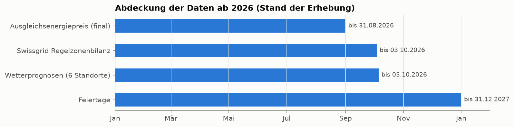
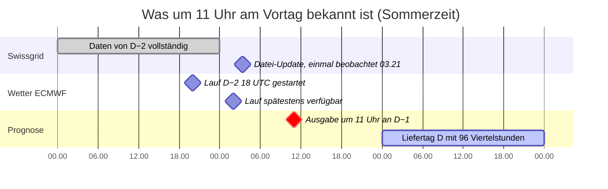
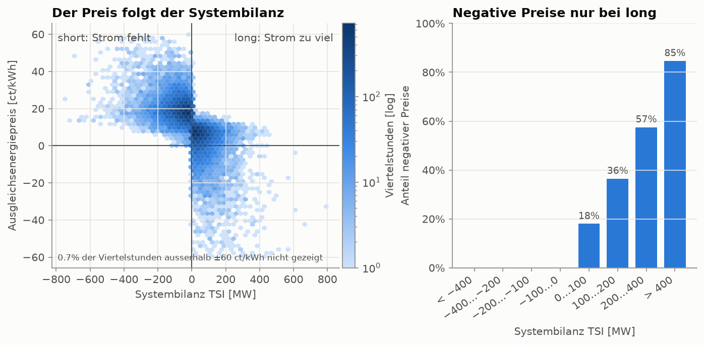
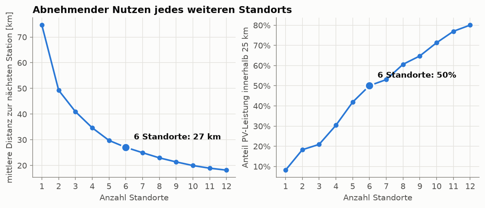
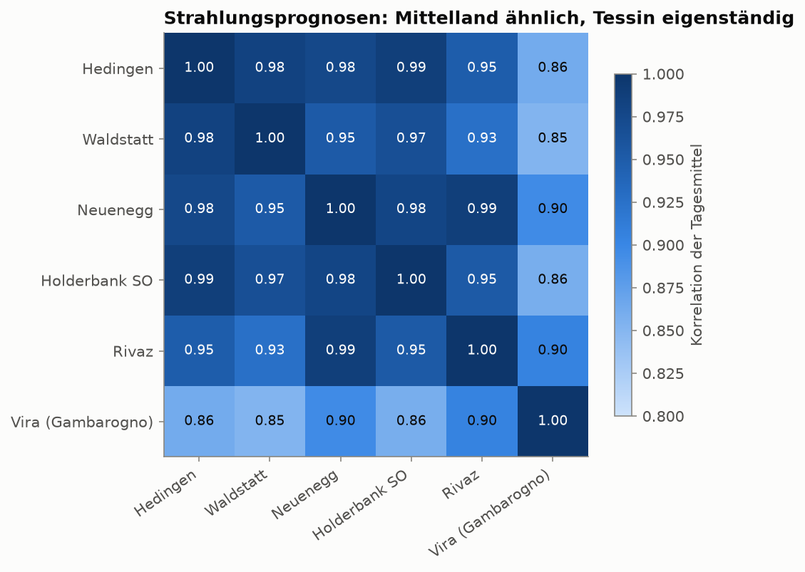
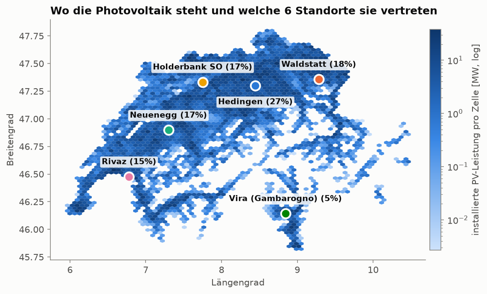
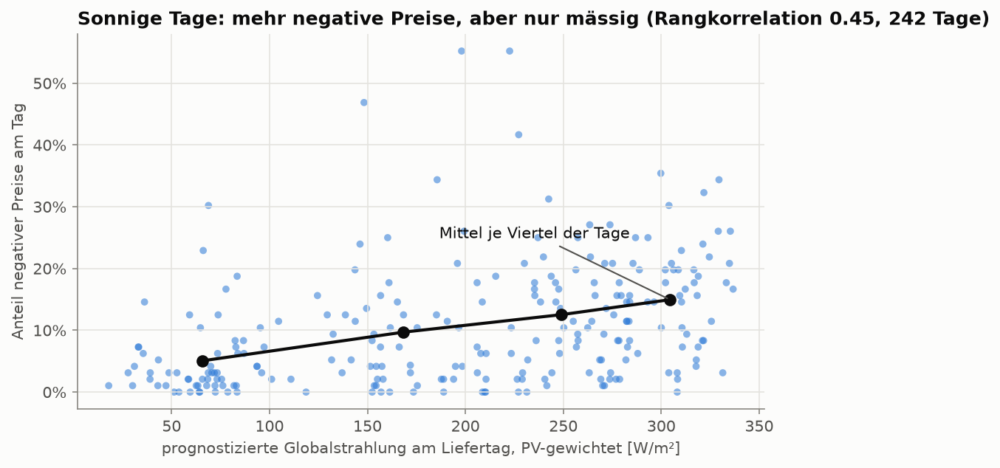
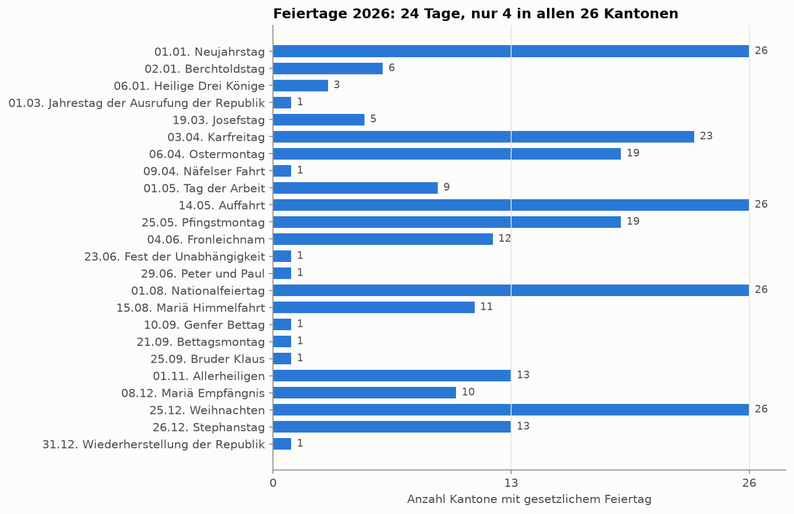
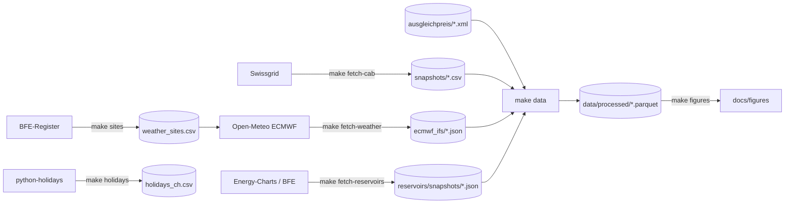

# Datengrundlage

> Stand der Erhebung: 2026-10-04. Alle Zahlen in diesem Dokument sind aus den Daten gemessen und lassen sich mit `make data` und `make figures` reproduzieren. Wo etwas eine Vermutung ist, steht es ausdrücklich so da.

## Kurzfassung

| Quelle | Was sie sagt | Zeitraum | Um 11:00 am Vortag bekannt? |
|---|---|---|---|
| **Ausgleichsenergiepreis** (Swissgrid, final) | die Zielgrösse | 01.01. bis 31.08.2026 | nur Vergangenheit, siehe Regel unten |
| **Regelzonenbilanz** (Swissgrid) | ob in der Schweiz Strom fehlte oder zu viel da war | 01.01. bis 03.10.2026 | vermutlich bis Ende D−2, **wird bis ca. 18.10. geprüft** |
| **Wetterprognosen** (ECMWF, 6 Standorte) | Sonne, Wolken, Temperatur, Wind, Niederschlag für den Liefertag | Liefertage 01.01. bis 05.10.2026 | ja, Lauf von D−2 18 UTC |
| **Feiertage** (alle 26 Kantone) | arbeitsfreie Tage | 2026 und 2027 | ja, gesetzlich festgelegt |
| ENTSO-E Lastprognose | erwarteter Verbrauch | nicht erhoben | **nicht belegbar**, siehe [Abschnitt 6](#6-nicht-erhoben-entso-e-lastprognose) |



Die wichtigsten Befunde:

1. **Die Systembilanz erklärt den Preis sehr gut** (Rangkorrelation −0.77). Negative Preise gibt es *nur*, wenn die Schweiz zu viel Strom hat.
2. **Die Wetterprognose hängt mit negativen Preisen zusammen, aber nur mässig** (Rangkorrelation 0.45 auf Tagesebene).
3. **Sechs Wetterstandorte decken die Photovoltaik gut ab.** Mehr Standorte im Mittelland bringen kaum neue Information, weil deren Prognosen fast identisch sind.

---

## 1. Die Regel gegen Datenlecks

Die Prognose wird am Vortag (D−1) um 11:00 für alle Viertelstunden des Liefertags (D) erstellt (siehe [Meeting-Protokoll](meetings/2026-10-01_owner.md)). Ein Datenpunkt darf nur verwendet werden, wenn er **zu diesem Zeitpunkt nachweislich publiziert war**. Für jede Quelle gilt deshalb eine eigene Grenze:



*Das Datum ist ein Platzhalter, es zählen die Uhrzeiten. In der Winterzeit liegen die Swissgrid- und ECMWF-Zeiten eine Stunde früher; die Reserve bis 11:00 ist dann eine Stunde grösser.*

| Quelle | Grenze | Beleg |
|---|---|---|
| Swissgrid (Preis und Bilanz) | Daten bis **D−2, 24:00** (**Annahme, wird geprüft**) | Die Grenze setzt voraus, dass Swissgrid die Datei **täglich** aktualisiert. Belegt ist bisher nur **eine** Beobachtung: Am Sonntag, 04.10.2026, um 01:21 UTC (03:21 Schweizer Zeit) enthielt sie alles bis 03.10., 23:45. Die Swissgrid-Webseite spricht aber von einer Publikation „on a weekly basis“, und im Web-Archiv gibt es keine älteren Versionen. Wird die Datei nur wöchentlich aktualisiert, leckt die Grenze D−2 um bis zu 5 Tage. Siehe [Prüfung des Aktualisierungsrhythmus](#prüfung-des-aktualisierungsrhythmus). Eine Echtzeit-Datei mit 30 Minuten Verzug, wie sie die Bilanzgruppenvorschriften erwähnen, war auf der Webseite nicht auffindbar. |
| Wetter | Lauf **D−2, 18 UTC** | Laut Open-Meteo sind Läufe globaler Modelle 4 bis 6 Stunden nach dem Start abrufbar. Mit 6 Stunden gerechnet bleiben bis 11:00 **9 Stunden Reserve im Sommer und 10 im Winter**, an jedem Tag 2026, auch an den Umstellungstagen. Das prüft der Test `test_every_run_of_2026_is_available_at_least_9_hours_before_issue`. |
| Feiertage | keine | durch kantonales Recht Jahre im Voraus festgelegt |
| Stauseen | letzter tatsächlich vor D−1, 11:00 abgerufener Wochenbericht | `latest_reservoir_report` prüft Abrufzeit und Berichtswoche; historische Publikationszeiten sind nicht belegt. Details in [Abschnitt 6](#6-stauseen-energy-chartsbfe). |

**Korrektur gegenüber früher:** Im ersten Entwurf stand „Daten bis D−1, 10:30“. Das ist nicht belegbar und gilt nicht mehr.

### Regel für Merkmale: Grenze statt fester Abstand

Die Grenze für Swissgrid-Daten ist ein **Zeitpunkt** (Ende von D−2), kein fester Abstand zur Zielviertelstunde. Wie weit man zurückgreifen muss, hängt deshalb von der Zielviertelstunde ab:

| Zielviertelstunde | jüngster erlaubter Wert | Abstand |
|---|---|---|
| D 00:00 | D−2 23:45 | 24 h 15 min |
| D 11:00 | D−2 23:45 | 35 h 15 min |
| D 23:45 | D−2 23:45 | 48 h |

Ein fester Abstand ist darum falsch. Beispiel: „35 Stunden zurück“ ergibt für D 23:45 den Wert von D−1 12:45, also einen Wert **nach** der Prognose um 11:00. Für D 11:00 ergibt er D−1 00:00, einen Wert, der um 11:00 noch nicht publiziert war.

**Im Code:** Die Funktion `known_at_issue(tabelle, liefertag)` in `src/energy_price/availability.py` gibt nur die Zeilen zurück, die zum Prognosezeitpunkt bekannt waren. Alle Merkmale aus Swissgrid-Daten werden damit gebildet, nie durch Verschieben um einen festen Lag. Die Tests in `tests/test_availability.py` halten die Grenze fest, auch an den Umstellungstagen.

### Bekanntes Restrisiko: Swissgrid überschreibt Werte

Für Januar bis August ist der Preis in der Swissgrid-Datei **zu 100 % identisch mit dem finalen Monatspreis**. Swissgrid ersetzt die provisorischen Werte also später durch finale. Um 11:00 hätte man aber nur provisorische Werte gekannt. Das betrifft jedes Merkmal aus vergangenen Preisen, egal ob aus den Monatsdateien (`balance_prices.parquet`) oder aus der Regelzonenbilanz (`price_ct_kwh`). Ob Swissgrid auch die Systembilanz (`tsi_mw`) nachträglich ändert, ist unbekannt. Selbst die Einhaltung der Grenze aus dem vorherigen Abschnitt verhindert diesen Effekt nicht: Ein Rückblick mit diesen Daten ist darum leicht zu optimistisch. Wie gross die Korrekturen sind, ist **noch nicht gemessen**. Darum speichern wir jede Version als Snapshot (siehe [Abschnitt 3](#3-swissgrid-regelzonenbilanz)): Der Snapshot vom 04.10. enthält für September und Oktober noch provisorische Werte. Sobald die finalen Septemberpreise publiziert sind (bis zum 15. Arbeitstag im Oktober), lässt sich der Unterschied direkt vergleichen.

---

## 2. Ausgleichsenergiepreis

Die Zielgrösse, bereits mit dem Repo geliefert (`data/ausgleichpreis/`, Aufbereitung in `src/energy_price/swissgrid.py`, beschrieben im [README](../README.md#data)). Seit 2026 gilt **ein** Preis pro Viertelstunde (`aep_ct_kwh`), vorher zwei (`long_ct_kwh`, `short_ct_kwh`). Gemäss Owner-Entscheid verwenden wir nur 2026: 23'324 Viertelstunden, final bis 31.08.2026.

Wie der Preis berechnet wird, erklärt [overview.md](overview.md).

---

## 3. Swissgrid Regelzonenbilanz

### Was das ist

Die Schweiz ist **eine Regelzone**, vorstellbar als ein grosses Becken, in das alle einspeisen und aus dem alle entnehmen. Die **Systembilanz** (*Total System Imbalance*, TSI) sagt für jede Viertelstunde, ob in diesem Becken Strom fehlte oder zu viel da war:

| TSI | Bedeutung | Swissgrid ruft ab | Preis |
|---|---|---|---|
| **negativ** (short) | Strom fehlt | positive Regelenergie | A, eher hoch |
| **positiv** (long) | zu viel Strom | negative Regelenergie | B, eher tief, oft negativ |

Die Vorzeichen-Konvention steht so auf der Swissgrid-Webseite und ist in unseren Daten bestätigt: Median-Preis **18.9 ct/kWh bei short**, **5.6 ct/kWh bei long**.

### Was in der Datei steht

`control-area-balance-2026.csv`, eine Zeile pro Viertelstunde, Werte in MW (Viertelstundenmittel). Swissgrid bezeichnet sie als „indicative estimates calculated from real-time systems“.

| Spalte | Bedeutung |
|---|---|
| `tsi_mw` | Systembilanz, siehe oben |
| `afrr_pos_mw`, `afrr_neg_mw` | abgerufene automatische Regelenergie (Sekundärregelung) |
| `mfrr_sa_pos_mw`, `mfrr_sa_neg_mw` | abgerufene manuelle Regelenergie, geplante Aktivierung (Tertiärregelung) |
| `mfrr_da_pos_mw`, `mfrr_da_neg_mw` | manuelle Regelenergie, direkte Aktivierung. **2026 durchgehend 0** |
| `igcc_import_mw`, `igcc_export_mw` | Ausgleich über den europäischen Netzregelverbund (in der Datei „NRV“) |
| `frce_pos_mw`, `frce_neg_mw` | verbleibende Regelabweichung (*Frequency Restoration Control Error*) |
| `price_ct_kwh` | Ausgleichsenergiepreis (für abgeschlossene Monate identisch mit dem finalen Preis) |

### Was sie mit dem Preis zu tun hat



*Die Grafik vergleicht Systembilanz und Preis **derselben** Viertelstunde, um den Mechanismus zu zeigen. Für ein Modell ist das verboten: Die Bilanz der Zielviertelstunde ist um 11:00 am Vortag unbekannt (siehe [Regel für Merkmale](#regel-für-merkmale-grenze-statt-fester-abstand)).*

- Anteil short: 54.7 % der Viertelstunden 2026.
- **Negative Preise: 0.0 % bei short, 23.4 % bei long.** Ab +400 MW sind es 85 %.
- Rangkorrelation TSI und Preis: **−0.77**.
- **Beobachtung, keine Erklärung:** Die auf der Swissgrid-Webseite genannten Knappheitsschwellen (−1200 MW / +1000 MW) wurden 2026 nie erreicht; die TSI lag zwischen −1072 und +792 MW. Die 43 Viertelstunden mit Preisen unter −100 ct/kWh hatten eine TSI von im Median +335 MW. Die Extrempreise kommen demnach aus den Preisen der abgerufenen Regelenergie, nicht aus der Knappheitskomponente. Ob die Schwellen auf der Webseite für 2026 noch gelten, ist offen.

**Wozu wir sie brauchen:** Die Bilanz *des Liefertags* kennt niemand um 11:00. Aber ihre Muster bis D−2 (wie oft war das System zu welcher Tageszeit short, wie stark schwankt es gerade) sind erlaubte Merkmale.

### Wie sie gespeichert wird

Weil sich die Datei nachträglich ändert, wird **jede neue Version als Snapshot** abgelegt: `data/control_area_balance/snapshots/control-area-balance-2026_<Abrufzeit UTC>.csv`. `manifest.csv` hält für jeden Snapshot Abrufzeit, `Last-Modified`, SHA-256-Prüfsumme und Zeitraum fest. Ist der Inhalt unverändert, wird nichts gespeichert. Erster Snapshot: 2026-10-04, 13:47:09 UTC, 26'492 Viertelstunden.

`fetch_log.csv` protokolliert zusätzlich **jeden** Abruf, auch wenn sich nichts geändert hat: Zeitpunkt, `Last-Modified`, letzter Zeitstempel in der Datei und `days_behind`, also wie viele Tage der letzte vollständige Tag hinter dem Abruftag liegt.

### Prüfung des Aktualisierungsrhythmus

Von 05.10. bis ca. 18.10.2026 ruft ein Hintergrundjob auf dem Rechner von Luca (macOS `launchd`, Label `ch.fhnw.energy-price.fetch-cab`) täglich um **10:30** `make fetch-cab` auf, eine halbe Stunde vor der Prognosezeit. Auswertung:

- `days_behind = 1` an **jedem** Tag: Die Grenze D−2 ist bestätigt.
- `days_behind` grösser als 1 an einzelnen Tagen: Die Grenze muss in `src/energy_price/availability.py` nach hinten verschoben werden, auf den schlechtesten beobachteten Fall.

War der Rechner um 10:30 im Ruhezustand, holt `launchd` den Abruf beim Aufwachen nach; die tatsächliche Zeit steht im Log. Solche Abrufe nach 11:00 zählen für den Nachweis nicht. Bis die Prüfung abgeschlossen ist, gelten alle Ergebnisse, die Swissgrid-Daten als Merkmal verwenden, als **vorläufig**.

Nebenbei hält der Job jede neue Version als Snapshot fest. So lässt sich später messen, wie stark Swissgrid korrigiert.

---

## 4. Wetterprognosen an sechs Standorten

### Warum Wetter

Wenn die Sonne anders scheint als prognostiziert, liefern PV-Anlagen mehr oder weniger als geplant. Die Bilanzgruppen weichen von ihren Fahrplänen ab, und die Systembilanz entsteht. **Photovoltaik ist dabei der entscheidende Faktor:** Laut BFE-Register sind 8'829 MW PV installiert, aber nur 110 MW Windkraft. Darum sind Strahlung und Bewölkung die wichtigsten Variablen.

### Woher: archivierte Prognosen, nicht gemessenes Wetter

Für einen ehrlichen Rückblick braucht es das Wetter, **das um 11:00 prognostiziert war**, nicht das, das tatsächlich eintrat. Quelle ist das Modell **ECMWF IFS** (9 km Auflösung) über die [Open-Meteo Single Runs API](https://open-meteo.com/en/docs/single-runs-api). Diese liefert einzelne, archivierte Modellläufe, für ECMWF ab März 2024.

Zwei bequemere Wege von Open-Meteo wurden bewusst **verworfen**, weil sie lecken würden:

| API | Problem |
|---|---|
| Historical Forecast API | setzt die ersten Stunden *jedes* Laufs zusammen, also Prognosen von kurz vor der Zielzeit |
| Previous Runs API | rechnet „24 h vor der Zielzeit“. Für 23:45 am Liefertag wäre das ein Lauf von 23:45 am Vortag, lange nach 11:00 |

Die MeteoSwiss-Modelle (ICON-CH1/CH2, 1 bis 2 km) wären feiner, sind im Archiv aber erst ab April 2026 vorhanden. Für Januar bis März fehlen sie, getestet am 15.01.2026.

### Warum genau diese sechs Standorte

**Schritt 1: Wo steht die PV?** Grundlage ist das amtliche [BFE-Register aller Produktionsanlagen](https://data.geo.admin.ch/ch.bfe.elektrizitaetsproduktionsanlagen/) mit 337'455 PV-Anlagen, Leistung und Koordinaten. 1.7 % der Leistung haben keine Koordinaten und bleiben aussen vor.

**Schritt 2: Wie viele Standorte?** Ein leistungsgewichtetes k-Means sucht für 1 bis 12 Standorte die Punkte, die der PV-Leistung im Mittel am nächsten sind.



| Standorte | mittlere Distanz der PV-Leistung zum nächsten Standort | Anteil PV innerhalb 25 km |
|---|---|---|
| 1 | 75 km | 8 % |
| 3 | 41 km | 21 % |
| **6** | **27 km** | **50 %** |
| 9 | 21 km | 65 % |
| 12 | 18 km | 80 % |

Von 1 auf 6 Standorte sinkt die Distanz um 48 km, von 6 auf 12 nur noch um 9 km. Die Kurve hat keinen scharfen Knick; **sechs ist eine Abwägung**, gestützt auf drei weitere Gründe:

1. **Das Wettermodell rechnet in 9-km-Zellen,** und benachbarte Standorte im Mittelland haben fast identische Prognosen. Die Korrelation der täglichen Strahlungsprognose liegt zwischen den fünf Mittelland-Standorten bei **0.93 bis 0.99**. Ein siebter Standort im Mittelland würde praktisch dieselbe Zahl noch einmal liefern.
2. **Das Tessin ist anders:** Mit den anderen korreliert es nur zu **0.85 bis 0.90**, weil die Alpensüdseite oft anderes Wetter hat. Deshalb bleibt Vira als eigener Standort, obwohl er nur 5 % der Leistung vertritt.
3. **Wenig Trainingsdaten:** Für 2026 gibt es rund 240 Liefertage mit Preis. Jeder Standort bringt 15 Variablen mal 25 Stunden. Mehr Standorte hiessen viel mehr Merkmale bei gleich wenig Tagen, also mehr Risiko für Überanpassung.



**Schritt 3: Vom Schwerpunkt zur Gemeinde.** Ein Schwerpunkt kann im See liegen; das passierte beim Genfersee. Jeder Schwerpunkt wird deshalb auf die nächstgelegene Gemeinde mit PV-Anlagen verschoben. Daher die eher kleinen Orte: Sie sind die Mitte der PV-Leistung ihrer Region, nicht die grössten Städte.



| Standort | Kanton | vertritt | PV-Anteil | Gitterzelle von Open-Meteo |
|---|---|---|---|---|
| Hedingen | ZH | Zürich, Aargau, Luzern, Zug | 27 % | 47.276, 8.382, 503 m |
| Waldstatt | AR | Ostschweiz | 18 % | 47.417, 9.295, 838 m |
| Neuenegg | BE | Bern, Freiburg | 17 % | 46.924, 7.293, 537 m |
| Holderbank SO | SO | Jurasüdfuss, Basel | 17 % | 47.346, 7.807, 652 m |
| Rivaz | VD | Genfersee, Wallis | 15 % | 46.503, 6.790, 447 m |
| Vira (Gambarogno) | TI | Alpensüdseite | 5 % | 46.081, 8.871, 230 m |

Open-Meteo wählt die nächste *Land*-Zelle: Rivaz liegt auf 447 m, also über dem Genfersee (372 m). Die Zelle für Vira liegt rund 7 km südlich am Lago Maggiore.

Die Standortwahl ist reproduzierbar (`make sites`) und lässt sich mit `N_SITES` in `src/energy_price/pv_sites.py` ändern.

### Was gespeichert ist

- **Rohdaten:** `data/weather/ecmwf_ifs/run_<Lauf>.json`, ein unverändertes API-Ergebnis pro Lauf mit Abfrage-URL und Abrufzeit. 278 Läufe, 18 MB.
- **Aufbereitet:** `data/processed/weather_forecasts.parquet`. Pro Liefertag und Standort 25 Stundenwerte von D 00:00 bis D+1 00:00, am kurzen Tag im März 24.

| Variable | Einheit | Art |
|---|---|---|
| `shortwave_radiation` (Globalstrahlung), `direct_radiation`, `diffuse_radiation`, `direct_normal_irradiance` | W/m² | Mittel der vorangehenden Stunde |
| `sunshine_duration` | s | Summe der vorangehenden Stunde |
| `precipitation` (mm), `snowfall` (cm) | | Summe der vorangehenden Stunde |
| `cloud_cover`, `cloud_cover_low`, `_mid`, `_high` | % | Momentwert |
| `temperature_2m` (°C), `relative_humidity_2m` (%) | | Momentwert |
| `wind_speed_10m`, `wind_speed_100m` | km/h | Momentwert |

Weil Strahlung und Niederschlag die *vorangehende* Stunde beschreiben, ist der Wert von D+1 00:00 enthalten: Er gehört zur letzten Stunde von D.

### Lücken im Archiv

| Was | Betroffen | Umgang |
|---|---|---|
| `snow_depth` | fehlt an 219 von 278 Tagen | heruntergeladen, aber **nicht verwendet** |
| Strahlung, Sonnenscheindauer, Wind 10 m, Luftfeuchte | 24.06.2026, alle Standorte | bleibt leer |
| Luftfeuchte | 12.06.2026, alle Standorte | bleibt leer |

Die Lücken werden bewusst **nicht** mit Werten aus anderen Läufen gefüllt. Ein späteres Modell soll gezielt damit umgehen. Die Liste steht in `data/processed/weather_missing.csv`.

### Erster Blick: Wetter und negative Preise



| Viertel der Tage nach Strahlungsprognose | Anteil negativer Preise | Median-Preis |
|---|---|---|
| trübste 25 % | 5 % | 14.1 ct/kWh |
| zweites Viertel | 10 % | 15.3 ct/kWh |
| drittes Viertel | 13 % | 14.5 ct/kWh |
| sonnigste 25 % | 15 % | 10.9 ct/kWh |

Ein Zusammenhang ist da, aber er ist **mässig** (Rangkorrelation 0.45 über 242 Tage). Ein Teil davon ist Saison: Innerhalb einzelner Monate schwankt die Korrelation zwischen −0.28 (März) und +0.36 (Februar). Die Wetterprognose allein wird den Preis also nicht erklären. Ob sie *zusammen* mit der Systembilanz hilft, ist eine Frage für die Modellierung.

---

## 5. Feiertage

Feiertage sind in der Schweiz **kantonal**: Nur 4 von 24 Feiertagen 2026 gelten in allen 26 Kantonen.



- **Quelle:** Python-Paket [`holidays`](https://pypi.org/project/holidays/) 0.105, nur die Kategorie „public“ (gesetzliche Feiertage), deutsche Namen. Gespeichert in `data/meta/holidays_ch.csv` (Datum, Kanton, Name), 2026 und 2027.
- **Geprüft:** Die beweglichen Feiertage 2026 stimmen mit dem Osterdatum (5. April) überein: Karfreitag 3.4., Ostermontag 6.4., Auffahrt 14.5., Pfingstmontag 25.5., Fronleichnam 4.6.
- **Nicht enthalten:** Brückentage, Schulferien und nicht gesetzliche Bräuche, zum Beispiel der Berchtoldstag in Zürich (in 6 anderen Kantonen ist er gesetzlich und enthalten).

Für ein Modell bietet sich an, pro Tag zu zählen, wie viele Kantone frei haben, oder wie viel Prozent der PV-Leistung in Kantonen mit Feiertag liegt (`pv_capacity_by_canton.csv`).

---

## 6. Stauseen: Energy-Charts/BFE

### Ablauf für das Team

Das ausführbare [Demo-Notebook](../notebooks/reservoir_demo.ipynb) zeigt die folgenden
Schritte mit den bestehenden Python-Modulen. Standardmässig arbeitet es mit den
gespeicherten Snapshots; der Netzwerkabruf ist separat einschaltbar.

1. **Quelle:** Energy-Charts stellt die BFE-Wochenwerte als JSON bereit.
2. **Abruf:** `make fetch-reservoirs` prüft das Format und vergleicht die Prüfsumme
   mit dem letzten Abruf. Bei Änderungen wird ein neuer Snapshot mit Abrufzeit
   gespeichert; frühere Versionen bleiben erhalten.
3. **Aufbereitung:** `make data` prüft die Werte, berechnet Schweizer Total und
   Füllungsgrad und schreibt alle Versionen in `reservoir_filling.parquet`.
4. **Auswahl für eine Prognose:** Beim Modellaufbau wird
   `latest_reservoir_report(table, delivery_day)` aufgerufen. Die
   Funktion nimmt den letzten Wochenbericht aus dem jüngsten Snapshot, der bis
   zum Vortag um 11 Uhr tatsächlich abgerufen wurde. Ohne einen solchen Snapshot
   liefert sie keine Zeilen.
5. **Modellmerkmale:** Die ausgewählten Regionalwerte können für alle
   Viertelstunden des Liefertags übernommen werden. Dieser Modellanschluss ist
   vorbereitet; `make data` erzeugt die Quelltabelle und ruft die Auswahlfunktion
   noch nicht auf.

### Quelle und Bedeutung

Das [Energy-Charts-Diagramm für die Schweiz 2026](https://www.energy-charts.info/charts/filling_level/chart.htm?l=de&c=CH&stacking=stacked_absolute_area&year=2026)
liest die [öffentliche Jahres-JSON](https://www.energy-charts.info/charts/filling_level/data/ch/year_storage_2026.json).
Diese Adresse stammt aus dem Diagramm-Skript `filling_level.js`; ein API-Schlüssel
ist nicht nötig. Sie ist eine Datenquelle der Webseite und kein zugesicherter
Endpunkt der dokumentierten Energy-Charts-API. Formatänderungen werden beim
Einlesen erkannt.

Die Originaldaten stammen vom **BFE**: wöchentlicher energetischer Speicherinhalt
für Wallis, Graubünden, Tessin und die übrige Schweiz, bezogen auf Sonntag 24 Uhr.
Die Betreiber melden bis Dienstag der Folgewoche; rückwirkende Korrekturen sind
möglich. Das BFE nennt einen wöchentlichen Veröffentlichungsrhythmus, aber keine
hier belegte Uhrzeit für jeden historischen Bericht.
Quellen: [BFE-Datenseite](https://www.bfe.admin.ch/de/fuellungsgrad-speicherseen),
[Steckbrief](https://pubdb.bfe.admin.ch/de/publication/download/12148),
[Publikationsplan 2026](https://pubdb.bfe.admin.ch/de/publication/download/7033).

Energy-Charts liefert **TWh**: Energieinhalt, kein Wasservolumen und keine Leistung.
Die maximale Speicherkapazität ist eine eigene Datenreihe pro Region. Der Schweizer
Energieinhalt wird aus den vier Regionen summiert; Kapazitätslinien werden nicht
zum Inhalt addiert. Der Füllungsgrad ist `100 * stored_twh / capacity_twh`.
Damit lässt sich die saisonale Speicherverfügbarkeit als Einflussgrösse prüfen;
ein Nutzen für die Preisprognose ist noch nicht gemessen.

### Dateien und Schema

`make fetch-reservoirs` speichert jede veränderte Antwort als
`data/reservoirs/snapshots/filling-level-2026_<Abrufzeit UTC>.json`.
Die Antwort steht unverändert im Feld `data`, ergänzt um URL, Jahr, Abrufzeit,
`Last-Modified` und SHA-256 der ursprünglichen Antwort.
`manifest.csv` beschreibt alle gespeicherten Versionen; `fetch_log.csv` protokolliert
auch Abrufe ohne Änderung. Ein unveränderter Download behält die erste Abrufzeit
dieser Version. Fehlerhafte Antworten ersetzen keine bestehenden Daten.

`make data` erzeugt `data/processed/reservoir_filling.parquet`. Jede Zeile ist eine
Kombination aus Snapshot, Woche und Region. Alte Versionen bleiben enthalten.

| Spalte | Bedeutung |
|---|---|
| `timestamp_utc`, `timestamp_local` | originaler Zeitstempel des Diagramms, UTC und Europe/Zurich |
| `reference_date` | Sonntag, auf den sich der Bericht bezieht; Datum ohne Zeitzone |
| `region` | `valais`, `grisons`, `ticino`, `other_switzerland`, `switzerland` |
| `stored_twh` | energetischer Speicherinhalt in TWh |
| `capacity_twh` | maximale Speicherkapazität in TWh |
| `filling_pct` | berechneter Füllungsgrad in Prozent |
| `fetched_at_utc`, `source_year`, `snapshot` | beobachtete Verfügbarkeit und Herkunft dieser Version |

Die JSON setzt die Zeitachse auf **Montag 00:00 UTC**, die Beschreibung meint
**Sonntag 24 Uhr**. Deshalb wird zusätzlich `reference_date` geführt. Die
Originalzeitstempel werden nicht als exakter Schweizer Messzeitpunkt interpretiert:
ihre Lokalzeit ist Montag 01:00 bzw. 02:00. Für dieses Wochenmerkmal zählt das
Berichtsdatum, für die Verfügbarkeit die Abrufzeit.

Ein fehlender Regionalwert bleibt leer; auch die Schweizer Summe bleibt dann leer.
Fehlende Wochen werden nicht interpoliert. Unbekannte Einheiten, fehlende oder
doppelte Reihen, abweichende Achsen und unplausible Kapazitäten führen zum Fehler.

### Stand beim ersten Abruf: 08.10.2026

- **39 vollständige Wochen**, Referenzsonntage 04.01. bis 27.09.2026; keine Lücken.
- **195 Zeilen**: fünf Regionen einschliesslich Schweizer Total, ein Snapshot.
- Letzter Gesamtinhalt: **6.588 TWh**, Kapazität **8.895 TWh**, Füllungsgrad **74.1 %**.
- Minimum bisher: **1.051 TWh** am 19.04.; Maximum: **6.639 TWh** am 20.09.
- `Last-Modified` der Quelldatei: 08.10.2026, 01:05:31 UTC. Trotzdem endet der
  Bericht am 27.09. Die Dateiaktualisierung belegt weder neue Wochenwerte noch
  deren historische Erstveröffentlichung.

### Verwendung zur Prognosezeit

```python
import datetime as dt
import pandas as pd
from energy_price.reservoir import latest_reservoir_report

table = pd.read_parquet("data/processed/reservoir_filling.parquet")
known = latest_reservoir_report(table, dt.date(2026, 10, 10))
features = known.set_index("region")[["stored_twh", "capacity_twh", "filling_pct"]]
```

Die Funktion wählt pro Quelljahr den jüngsten rechtzeitig beobachteten Snapshot
und daraus den letzten Wochenbericht. Spätere Revisionen sind ausgeschlossen.
Die fünf Regionalwerte können für alle Viertelstunden des Liefertags verwendet
werden; sie sind innerhalb dieses Tags konstant. Das Alter des Berichts lässt
sich aus `reference_date` ablesen.

**Grenze für den historischen Backtest:** Der erste Snapshot wurde am 08.10.2026
nach 11 Uhr abgerufen. Die Funktion liefert deshalb für Liefertage vor dem
10.10.2026 keine Daten, auch wenn der Snapshot Januarwerte enthält. Diese Werte
sind für EDA vorhanden, ihre damalige Veröffentlichung und Version aber nicht
bewiesen. Für historische Modellmerkmale braucht es archivierte Publikationsstände
oder eine separat belegte und ausdrücklich dokumentierte Verfügbarkeitsannahme.
Der Dienstag als Erhebungsschluss allein belegt keinen festen Publikationslag.

---

## 7. Nicht erhoben: ENTSO-E Lastprognose

Die ENTSO-E-Transparenzplattform veröffentlicht für die Schweiz eine Prognose des Gesamtverbrauchs für den nächsten Tag. Sie wäre nützlich, **ist aber nicht erhoben**, weil sich ihre Verfügbarkeit um 11:00 nicht belegen lässt:

- Die EU-Regel (Verordnung 543/2013) verlangt die Publikation spätestens zwei Stunden vor Auktionsschluss. Die Schweiz ist an diese Verordnung **nicht gebunden**.
- Die historischen Daten zeigen den Wert, aber nicht, **wann** er publiziert wurde.
- Die API verlangt einen persönlichen Token.

**Nächster Schritt, falls gewünscht:** Token beantragen, dann eine Woche lang täglich um 10:45 prüfen, ob die Prognose für morgen schon da ist. Erst danach kommt sie ins Modell.

---

## 8. Ablauf und Dateien



| Pfad | Inhalt | im Git |
|---|---|---|
| `data/ausgleichpreis/` | Swissgrid-Preise, monatlich | ja |
| `data/control_area_balance/snapshots/` | Regelzonenbilanz, jede Version mit `manifest.csv` | ja, die Versionen lassen sich später nicht mehr herunterladen |
| `data/weather/ecmwf_ifs/` | Wetterprognosen, ein JSON pro Lauf | ja, falls das Archiv verschwindet |
| `data/reservoirs/snapshots/` | Stausee-Wochenberichte, alle beobachteten Versionen mit Metadaten | ja, für Revisionen und beobachtete Verfügbarkeit |
| `data/meta/` | Standorte, PV pro Kanton, Standort-Kurve, Feiertage | ja |
| `data/external/` | BFE-Register (18 MB) | nein, `make sites` lädt es neu |
| `data/processed/` | aufbereitete Tabellen | nein, `make data` baut sie neu |

| Befehl | Wirkung |
|---|---|
| `make fetch` | holt neue Swissgrid-, Wetter- und Stauseedaten (Netzwerk) |
| `make fetch-reservoirs` | holt die Schweizer Stauseedaten 2026; weitere Jahre mit `RESERVOIR_YEARS="2025 2026"` |
| `make sites` | berechnet die Standorte neu aus dem BFE-Register |
| `make holidays` | schreibt die Feiertage neu |
| `make data` | baut alle Tabellen in `data/processed/` |
| `make figures` | erzeugt die Grafiken dieses Dokuments |

## 9. Offene Punkte

1. **Aktualisierungsrhythmus von Swissgrid bestätigen** (bis ca. 18.10.2026, siehe [Prüfung](#prüfung-des-aktualisierungsrhythmus)). Davon hängt die Grenze D−2 ab.
2. **Korrekturen von Swissgrid messen,** sobald die finalen Septemberpreise publiziert sind. Bis dahin ist offen, wie stark provisorische und finale Werte abweichen.
3. **Knappheitsschwellen klären:** Gelten die Werte von der Swissgrid-Webseite (−1200 / +1000 MW) für 2026? Frage an den Owner oder an Swissgrid.
4. **ENTSO-E-Token:** entscheiden, ob die Lastprognose geprüft werden soll.
5. **Historische Stausee-Verfügbarkeit belegen:** archivierte BFE-/Energy-Charts-Versionen und Publikationszeitpunkte suchen, bevor die neuen Werte im Backtest ab Januar als Merkmale verwendet werden.
