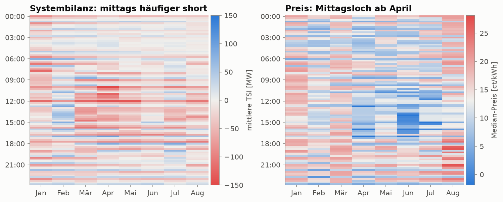
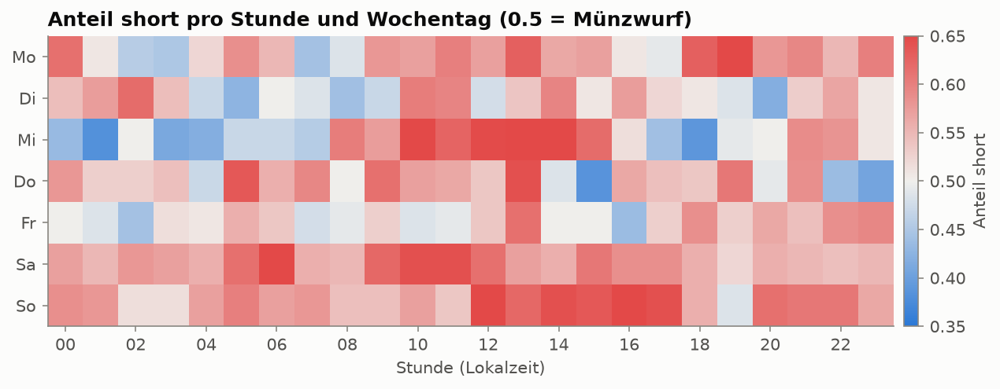
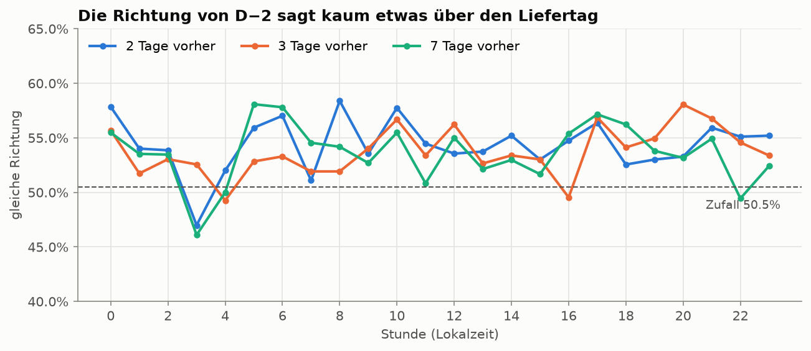
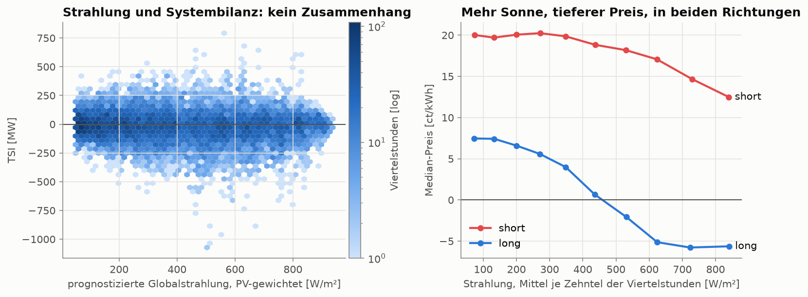
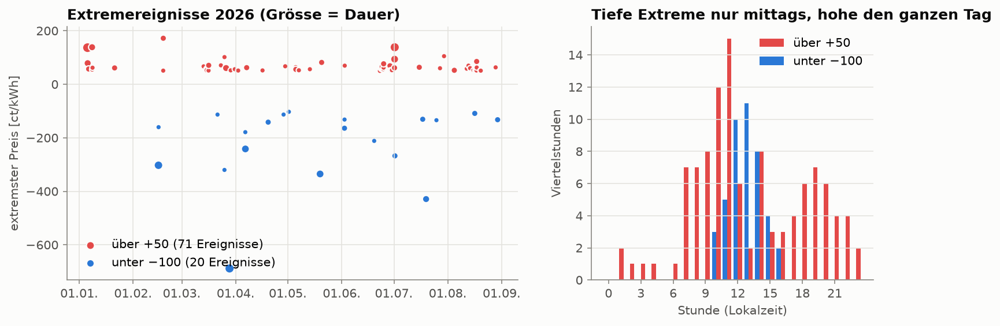
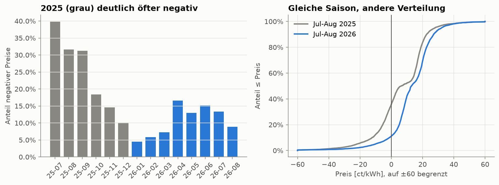
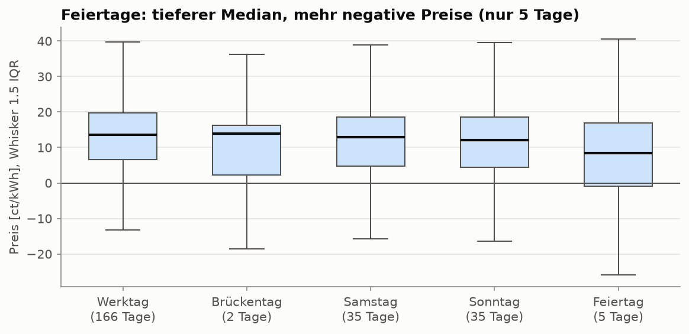
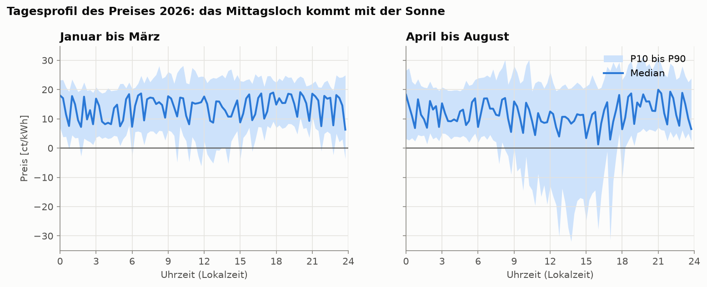
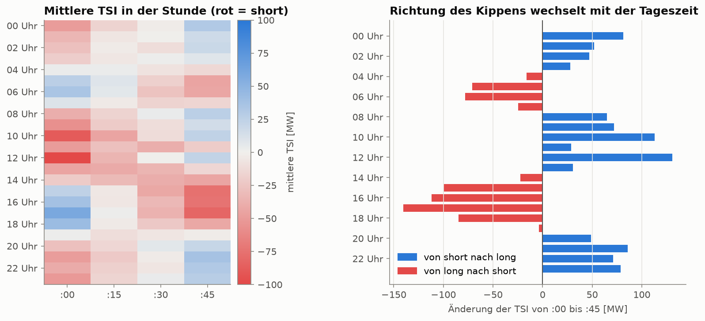
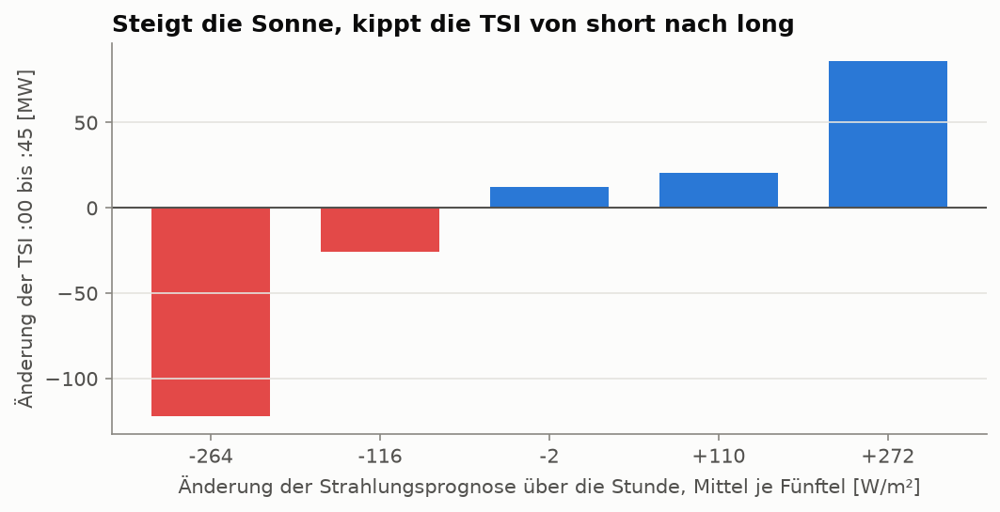

# Erste explorative Analyse

> Stand: 2026-10-06. Auftrag: [Issue #3](https://github.com/ibidreli/energy_price_prediction/issues/3). Alle Zahlen stammen aus [`notebooks/01_eda.ipynb`](../notebooks/01_eda.ipynb) und lassen sich mit `make data` und `make notebook` reproduzieren. Der automatische Überblick pro Tabelle entsteht mit `make profile` (HTML in `reports/`, nicht versioniert). Deutungen sind ausdrücklich als Vermutung markiert.

## Kurzfassung

1. **Die Richtung des Systems (short/long) lässt sich aus der Vergangenheit kaum vorhersagen.** Die Richtung von D−2 stimmt nur in 54 % der Viertelstunden mit dem Liefertag überein, Zufall wäre 50.5 %.
2. **Die Systembilanz kippt innerhalb jeder Stunde, und die Richtung folgt der Tageszeit.** Um 17 Uhr ist das System um :00 zu 30 % short, um :45 zu 79 %; um 21 Uhr ist es umgekehrt (79 % und 29 %). Ursache sind Fahrpläne, die zur vollen Stunde in Stufen wechseln, während Verbrauch und PV gleitend laufen (H8). Die Steigung der Strahlungsprognose erklärt einen Teil davon (Rangkorrelation 0.47) und ist um 11:00 bekannt.
3. **Die Sonne bestimmt das Preisniveau, nicht die Richtung.** Die Strahlungsprognose hängt mit der TSI praktisch nicht zusammen (Rangkorrelation −0.07), mit dem Preis bei long aber stark (−0.58).
4. **Die Owner-Entscheidung „nur Daten ab 2026“ wird gestützt.** Die parallel gerechneten Preise von 2025 sind deutlich anders verteilt (Juli und August: 36 % gegenüber 11 % negativ).
5. **Extreme und Unsicherheit hängen von Uhrzeit und Saison ab.** Tiefe Extreme gibt es nur mittags bei long, die Streuung ist am Nachmittag dreimal so gross wie in der Nacht.

## Hypothesen

| # | Hypothese | Warum sie zählt | Ergebnis |
|---|---|---|---|
| H1 | Die Systembilanz (TSI) hat ein wiederkehrendes Muster nach Viertelstunde des Tages, Wochentag und Monat. | Die TSI erklärt den Preis am stärksten (Rangkorrelation −0.77). Ihre Muster sind erlaubte Merkmale, die TSI selbst nicht. | **teilweise:** mittags und nach Position in der Stunde ja, Wochentag und Monat schwach |
| H2 | Die Richtung ist über mehrere Tage stabil: Zur gleichen Uhrzeit ist das System 2, 3 und 7 Tage später häufiger als zufällig in derselben Richtung. | Zeigt, ob die Vergangenheit bis D−2 etwas über den Liefertag sagt. | **kaum:** 54 % gegenüber 50.5 % Zufall |
| H3 | Die prognostizierte Strahlung hängt mit der TSI zusammen, nicht nur mit dem Preis (Weg „Sonne → Abweichung → Preis“). | Das ist das fachliche Argument für Wetter im Modell. | **widerlegt** für die TSI; mit dem Preis deutlich |
| H4 | Extrempreise (unter −100 und über +50 ct/kWh) häufen sich nach Uhrzeit, Wochentag, Monat, an Feiertagen und bei grosser \|TSI\|. | Extreme dominieren die Fehler und die Unsicherheit. | **bestätigt** |
| H5 | Der parallel publizierte Preis `aep_ct_kwh` von Juli bis Dezember 2025 ist ähnlich verteilt wie 2026. Dann wären 6 Monate mehr Trainingsdaten nutzbar. | Prüft die Owner-Entscheidung „nur Daten ab 2026“. | **widerlegt:** deutlich andere Verteilung |
| H6 | Preis und TSI unterscheiden sich an Feiertagen und Brückentagen von normalen Werktagen und Wochenenden. | Feiertage sind kantonal; nur 4 von 24 gelten überall. | **Preis: Hinweis ja**, nicht abgesichert (5 Tage); **TSI: nein**; Brückentage: keine Aussage |
| H7 | Der Preis hat ein typisches Tagesprofil über die 96 Viertelstunden, und seine Streuung hängt von der Viertelstunde ab. | Grundlage für Baseline und Unsicherheitsbänder. | **bestätigt**, zusätzlich stark abhängig von der Saison |
| H8 | Die TSI kippt innerhalb jeder Stunde, weil Fahrpläne zur vollen Stunde in Stufen wechseln, Verbrauch und PV aber gleitend. Die Richtung folgt der Steigung der Residuallast (Verbrauch minus PV). *Neu aus dem Review: Warum ist die erste Viertelstunde öfter short?* | Erklärt das Muster aus H1 und liefert Merkmale, die um 11:00 bekannt sind. | **bestätigt** (mit den Daten vereinbar; Fahrpläne und Verbrauch selbst sind nicht in den Daten) |

## Vorgehen

1. **Automatischer Bericht** mit `fg-data-profiling` 4.20.0, je Tabelle ein HTML. Das Paket hiess bis 2026 `ydata-profiling`. Es verlangt `pandas < 3`, darum läuft es in der eigenen Umgebung `.venv-profile` (gepinnt in `requirements-profile.lock`). Vorab geprüft: pandas 2.3.3 liest die mit pandas 3.0.6 geschriebenen Parquet-Dateien identisch; nur Textspalten kommen als `object` statt `str`.
2. **Manuelle Analyse** nach dem Skill `exploratory-data-analysis`: Typen, Fehlwerte, Duplikate, Verteilungen, Ausreisser, Zusammenhänge, Zeitmuster. Danach die Hypothesen H1 bis H7.
3. **Wiederverwendete Berechnungen** liegen getestet in `src/energy_price/eda.py` (`tests/test_eda.py`): Viertelstunde der Lokalzeit, Feiertagsanteil nach PV-Leistung, Tagtypen, Vergleich der Richtung über Tage, Extremereignisse, Wetter von Stunden auf Viertelstunden.

**Zeiträume:** Preise gibt es bis 31.08.2026, die TSI bis 03.10.2026. Alles, was TSI und Preis zusammen zeigt (H1, H3, H4, H6, H7, H8), nutzt Januar bis August. H2 betrachtet nur die TSI und nutzt den ganzen Zeitraum.

## Datenqualität

| Befund | Umgang |
|---|---|
| Preis und Regelzonenbilanz: keine Duplikate, lückenloses 15-Minuten-Raster, 29.03.2026 mit 92 Viertelstunden | nichts zu tun |
| Regelzonenbilanz: **eine** Viertelstunde (02.10.2026 14:00) ohne Abrufwerte, TSI und Preis vorhanden | nicht füllen; liegt nach dem letzten Preis |
| `mfrr_da_pos_mw`, `mfrr_da_neg_mw` 2026 durchgehend 0 | weglassen |
| `price_ct_kwh` der Regelzonenbilanz ist für Januar bis August zu 100 % gleich dem finalen Preis | dieselbe Grösse, nur einmal verwenden |
| Wetterlücken 24.06.2026 (Strahlung, Sonnenscheindauer, Wind 10 m, Luftfeuchte) und 12.06.2026 (Luftfeuchte) | Archivlücke, unabhängig vom Wetter; leer lassen |
| **Wetter: Jeder Wert um 00:00 Lokalzeit steht zweimal in der Tabelle**, als letzte Stunde des Laufs für D−1 und als erste des Laufs für D | Wer nach Zeitstempel mittelt, mischt den Lauf für D in D−1 23:00 bis 23:45 ein. Dieser Lauf erscheint erst nach der Prognose für D−1: ein Datenleck. `eda.weather_to_quarter_hours` nimmt nur die Zeile des passenden Liefertags (getestet) |
| Preis stark linksschief (−688 bis +172 ct/kWh), rund 5 % Ausreisser nach IQR-Regel | echte Werte, nicht entfernen; robuste Verluste und Quantile verwenden |
| Knappheitsschwellen −1200 / +1000 MW wurden nie erreicht (TSI −1072 bis +792 MW) | geklärt: ohne Wirkung auf unsere Daten, siehe [`overview.md`](overview.md#preisformel-seit-2026-einpreissystem) |

Zuordnung von Wetter zu Viertelstunden: Die Viertelstunden h−1:00 bis h−1:45 erhalten den Wert mit Zeitstempel h:00. Das passt genau zu Strahlung und Niederschlag (Wert der vorangehenden Stunde); Momentwerte wie Bewölkung liegen dann höchstens 45 Minuten neben ihrem Zeitstempel. Mittel über die sechs Standorte gewichtet nach PV-Anteil.

## Ergebnisse je Hypothese

### H1: Muster der Systembilanz

**Hypothese:** Die TSI hat ein wiederkehrendes Muster nach Viertelstunde des Tages, Wochentag und Monat.
**Ergebnis: teilweise bestätigt.**

- **Mittags häufiger short:** Zwischen 10 und 14 Uhr liegt die mittlere TSI bei **−32 MW**, im Rest des Tages bei −9 MW; short-Anteil **59 %** gegenüber 54 %. Das gilt in **7 von 8 Monaten**, nur im Februar nicht. Am stärksten im April (−66 gegenüber −7 MW).
- **Wochentag:** Samstag und Sonntag etwas häufiger short (58 % und 59 %) als Werktage (52 % bis 55 %).
- **Monat:** short-Anteil zwischen 50 % (Februar) und 59 % (Januar), ohne klare Saison.
- **Klein gegen die Streuung:** Die Standardabweichung der TSI ist 109 MW, der Unterschied zwischen Mittag und Rest 23 MW. Das Muster verschiebt die Wahrscheinlichkeit für short um wenige Prozentpunkte, es bestimmt die Richtung nicht.
- **Deutlich ist die Position in der Stunde**, in allen 8 Monaten. Die Ursache klärt H8.

| Viertelstunde | Anteil short | Median-TSI | Median-Preis |
|---|---|---|---|
| :00 | 58.4 % | −19 MW | 14.5 ct/kWh |
| :15 | 55.4 % | −10 MW | 13.6 ct/kWh |
| :30 | 54.8 % | −9 MW | 13.1 ct/kWh |
| :45 | 50.1 % | 0 MW | 11.1 ct/kWh |

- Der Preis hat ein Mittagsloch ab April, obwohl die TSI mittags eher short ist. Das erklärt H3.

### H2: Stabilität der Richtung über Tage

**Hypothese:** Zur gleichen Uhrzeit ist das System 2, 3 und 7 Tage später häufiger als zufällig in derselben Richtung.
**Ergebnis: kaum.** Ganzer TSI-Zeitraum bis 03.10.2026.

| Abstand | gleiche Richtung zur gleichen Uhrzeit | um 11:00 bekannt? |
|---|---|---|
| 1 Tag | 55.2 % | **nein** (D−1 noch nicht publiziert) |
| 2 Tage | 54.4 % | ja (Annahme D−2) |
| 3 Tage | 53.7 % | ja |
| 7 Tage | 53.6 % | ja |
| Zufall bei 55 % short | 50.5 % | |

Die Autokorrelation der Tagesmittel der TSI liegt bei 0.15 nach 2 Tagen und 0.01 nach 7. **Die Vergangenheit bis D−2 sagt wenig über die Richtung am Liefertag.**

### H3: Strahlung und Systembilanz

**Hypothese:** Die prognostizierte Strahlung hängt mit der TSI zusammen, nicht nur mit dem Preis.
**Ergebnis: für die TSI widerlegt, für den Preis deutlich.**

- Strahlungsprognose und TSI derselben Viertelstunde (Tageslicht): Rangkorrelation **−0.07**, mit |TSI| **+0.07**, in keinem Monat über 0.18 im Betrag.
- Strahlung und Preis: **−0.23** insgesamt, **−0.58 bei long**, **−0.39 bei short**.
- Der Weg „Sonne → Abweichung → Preis“ ist damit **nicht** belegt. **Vermutung:** Die Sonne senkt das Preisniveau der abgerufenen Regelenergie, etwa über tiefe Spotpreise am Mittag. Für die TSI wäre der *Fehler* der Strahlungsprognose massgebend, und der ist um 11:00 unbekannt.

### H4: Extrempreise

**Hypothese:** Extrempreise häufen sich nach Uhrzeit, Wochentag, Monat, an Feiertagen und bei grosser |TSI|.
**Ergebnis: bestätigt.**

| | unter −100 ct/kWh | über +50 ct/kWh |
|---|---|---|
| Viertelstunden / Ereignisse / Tage | 43 / 20 / 17 | 110 / 71 / 41 |
| Uhrzeit | nur 10 bis 16 Uhr | ganzer Tag, Schwerpunkt 07 bis 11 Uhr und abends |
| Wochentag | 23 von 43 am Wochenende | fast nur Montag bis Donnerstag und Sonntag |
| TSI | immer long, Median +335 MW | immer short, Median −312 MW |
| längstes Ereignis | 6 Viertelstunden | 7 Viertelstunden |

Extreme betreffen 0.7 % der Viertelstunden. Sie sind kurz und an die Richtung gebunden, die um 11:00 unbekannt ist. Ein Modell sollte sie über breite Quantile abbilden, nicht als Punktprognose.

### H5: Preise 2025 gegenüber 2026

**Hypothese:** `aep_ct_kwh` von Juli bis Dezember 2025 ist ähnlich verteilt wie 2026.
**Ergebnis: widerlegt.**

Zwei Vergleiche: dieselbe Saison (Juli und August beider Jahre) und alles, was vorliegt. Der Saisonvergleich ist der faire, weil der Anteil negativer Preise stark vom Monat abhängt.

| Vergleich | Zeitraum | Viertelstunden | Anteil negativ | Median [ct/kWh] | P10 [ct/kWh] |
|---|---|---|---|---|---|
| gleiche Saison | Juli und August 2025 | 5'952 | 36 % | 6.4 | −12.2 |
| gleiche Saison | Juli und August 2026 | 5'952 | 11 % | 12.9 | −1.2 |
| alles verfügbare | Juli bis Dezember 2025 | 17'668 | 24 % | 15.4 | −7.8 |
| alles verfügbare | Januar bis August 2026 | 23'324 | 11 % | 13.1 | −0.6 |

Der Kolmogorov-Smirnov-Abstand (grösster Unterschied der beiden Verteilungsfunktionen) ist **0.30** im Saisonvergleich und 0.18 über alles. Kein p-Wert, weil benachbarte Viertelstunden stark abhängig sind. `aep_ct_kwh` von 2025 ist keiner der damaligen beiden Preise, also eine echte Parallelrechnung. **Empfehlung:** bei „nur 2026“ bleiben; 2025 höchstens als Robustheitstest. **Vermutung zur Ursache:** Die Bilanzgruppen handelten unter dem Zweipreissystem anders.

### H6: Feiertage und Brückentage

**Hypothese:** Preis und TSI unterscheiden sich an Feiertagen und Brückentagen von normalen Werktagen und Wochenenden.
**Ergebnis: beim Preis ein Hinweis, nicht abgesichert; bei der TSI nein.**

| Tagtyp (bis 31.08.) | Tage | Median-Preis [ct/kWh] | Anteil negativ | Anteil short |
|---|---|---|---|---|
| Werktag | 166 | 13.6 | 8 % | 53 % |
| Brückentag | 2 | 13.9 | 16 % | 53 % |
| Samstag | 35 | 12.9 | 16 % | 58 % |
| Sonntag | 35 | 12.1 | 17 % | 59 % |
| Feiertag | 5 | 8.4 | 26 % | 54 % |

Feiertag heisst: Montag bis Freitag, an dem Kantone mit mindestens 50 % der PV-Leistung frei haben. Feiertage verhalten sich wie verstärkte Sonntage, aber **5 Tage reichen nicht als Beleg**, und vier davon liegen im sonnigen Frühling.

### H7: Tagesprofil

**Hypothese:** Der Preis hat ein typisches Tagesprofil, und seine Streuung hängt von der Viertelstunde ab.
**Ergebnis: bestätigt, zusätzlich stark abhängig von der Saison.**

- Median am tiefsten um 10:45 (6.2 ct/kWh), am höchsten um 21:00 (19.0).
- Streuung P10 bis P90 am grössten um 17:00 (46.5 ct/kWh), am kleinsten um 03:15 (15.2).
- April bis August: P10 bis −31.9 ct/kWh am Mittag; Januar bis März nur bis −6.1. **Ein einziges Profil für alle Monate wäre falsch.**
- Das Sägezahnmuster innerhalb jeder Stunde ist der Effekt der Position in der Stunde aus H1.

### H8: Kippen der Systembilanz innerhalb der Stunde

**Hypothese:** Fahrpläne und viele Kraftwerke wechseln zur vollen Stunde in Stufen, Verbrauch und PV-Erzeugung ändern sich gleitend. Darum kippt die TSI innerhalb jeder Stunde, und die Richtung folgt der Steigung der Residuallast (Verbrauch minus PV): Steigt sie, ist :00 long und :45 short; fällt sie, umgekehrt.
**Ergebnis: bestätigt**, soweit es ohne Fahrplan- und Verbrauchsdaten prüfbar ist.

**Mechanismus aus der Literatur:**
- Laut EURELECTRIC und ENTSO-E (Dezember 2011) ändern Kraftwerke ihre Einspeisung zur vollen Stunde „almost step-wise“, der Verbrauch ändert sich langsamer. Das erzeugt Abweichungen in einem Fenster von etwa zehn Minuten um den Stundenwechsel, am stärksten um 6, 7, 8, 21, 22 und 23 Uhr.
- Swissgrid rechnet Fahrplanwechsel als Rampe von 5 Minuten vor bis 5 Minuten nach dem Wechsel ab (Bilanzgruppenvorschriften v3.2, Ziffer 7.2).
- Quellen [S4] und [S5] in [`overview.md`](overview.md#10-quellen).

- **Das Kippen ist gross:** Um 17 Uhr ist die TSI um :00 im Mittel +59 MW (zu 30 % short), um :45 −82 MW (zu 79 % short). Um 12 Uhr ist es umgekehrt: −108 MW um :00, +23 MW um :45. Die vier Viertelstunden liegen meist fast auf einer Geraden, wie bei einer Stufe gegen eine gleitende Änderung zu erwarten.
- **Die Richtung folgt der Residuallast:**
  - von long nach short (Residuallast steigt) um 04 bis 07 Uhr (Morgenrampe) und 14 bis 18 Uhr (PV nimmt ab);
  - von short nach long (Residuallast fällt) um 08 bis 13 Uhr (PV nimmt zu) und 20 bis 03 Uhr (Verbrauch sinkt).
- **Darum ist :00 im Mittel öfter short:** 15 der 24 Stunden kippen von short nach long. Der Durchschnitt aus H1 (58 % gegenüber 50 %) mischt zwei entgegengesetzte Muster und unterschätzt den Effekt: Je nach Stunde liegt der short-Anteil um :00 zwischen 30 % und 80 %.

- **Die Strahlungsprognose erklärt einen Teil:** Die Änderung der Strahlungsprognose über die Stunde hängt mit dem Kippen zusammen (Rangkorrelation **0.47**, 3'880 Stunden mit wechselnder Sonne). Steigt die Strahlung stark (im Mittel +272 W/m²), kippt die TSI um +86 MW nach long; fällt sie stark (−264 W/m²), um −122 MW nach short.
- **Die Kipp-Stunden wandern mit Sonnenauf- und -untergang:** Um 07 Uhr kippt die TSI im Januar nach short (−167 MW, Morgenrampe im Dunkeln), ab März nach long. Um 19 Uhr kippt sie im Januar nach long (+94 MW), von April bis Juli nach short.
- **Ausgeglichen wird vor allem mit manueller Regelenergie:** Netto-Abrufe mFRR +18 MW um :00, +3 MW um :45.
- **Der Preis folgt:** In Stunden, die von short nach long kippen, ist der Median-Preis um :00 16.9 und um :45 8.0 ct/kWh; in den anderen Stunden umgekehrt (8.8 und 16.5).
- **Nicht prüfbar mit unseren Daten:** der Anteil des Verbrauchs. Dafür bräuchte es Last- oder Fahrplandaten, siehe Teamfrage zu ENTSO-E unten.

## Merkmals-Kandidaten

Nur Merkmale, die um **11:00 an D−1** bekannt sind. Swissgrid-Merkmale gelten als vorläufig, bis die Grenze D−2 bestätigt ist (ca. 18.10.2026), und beruhen auf finalen statt provisorischen Werten (messbar ab ca. 21.10.2026).

| Merkmal | Quelle | Verfügbarkeit um 11:00 | erwarteter Nutzen | Begründung aus der EDA |
|---|---|---|---|---|
| Viertelstunde in der Stunde × Uhrzeit (bzw. Viertelstunde des Tages) | Kalender | immer | **hoch** | H8: je nach Stunde :00 zu 30 % bis 80 % short; die Richtung des Kippens hängt von der Uhrzeit ab, darum nur zusammen mit der Uhrzeit sinnvoll |
| Steigung der Strahlungsprognose über die Stunde, zusammen mit der Viertelstunde in der Stunde | ECMWF, Lauf D−2 18 UTC | ja | **hoch** für die Richtung innerhalb der Stunde | H8: Rangkorrelation 0.47 mit dem Kippen der TSI; verschiebt die Kipp-Stunden mit Sonnenauf- und -untergang |
| Strahlungsprognose pro Viertelstunde, PV-gewichtet | ECMWF, Lauf D−2 18 UTC | ja | **hoch** für das Preisniveau, keiner für die Richtung | H3: −0.58 bei long, −0.39 bei short; H7: Mittagsloch nur in sonnigen Monaten |
| Uhrzeit (Viertelstunde des Tages) | Kalender | immer | mittel | H1: mittags häufiger short; H7: Median und Streuung hängen stark von der Uhrzeit ab; H4: tiefe Extreme nur mittags |
| Wochentag bzw. Wochenende | Kalender | immer | mittel | H4: hohe Extreme an Werktagen, tiefe am Wochenende; H6: Wochenenden doppelt so oft negativ |
| Anteil der PV-Leistung mit Feiertag, Tagtyp | Feiertage und PV-Register | immer | mittel, unsicher | H6: 26 % negativ an Feiertagen, aber nur 5 Tage |
| Saison (Monat oder Tageslänge) | Kalender | immer | mittel, mit Risiko | H7: Profil hängt stark von der Saison ab; nur 8 Monate Daten, darum eher über die Strahlung abbilden |
| Mittlere TSI bzw. short-Anteil an D−2 | Swissgrid über `known_at_issue()` | vermutlich (Annahme D−2) | gering | H2: Autokorrelation 0.15 nach 2 Tagen |
| Richtung zur gleichen Uhrzeit an D−2 oder D−7 | Swissgrid über `known_at_issue()` | vermutlich (Annahme D−2) | gering | H2: 54 % gegenüber 50.5 % Zufall |
| Preisniveau der Vergangenheit (z.B. Median je Viertelstunde bis D−2) | Swissgrid über `known_at_issue()` | vermutlich; um 11:00 nur provisorische Werte | **nicht untersucht** | in dieser EDA nicht gemessen; eigenes Issue |
| Steigung der Lastprognose über die Stunde | ENTSO-E (nicht erhoben) | **unbelegt**, siehe Teamfrage | vermutlich hoch für Abend, Nacht und Morgen | H8: dort kippt die TSI ohne Sonne; die Strahlung erklärt diese Stunden nicht |

**Verboten**, auch wenn sie den Preis gut erklären: TSI, Abrufe und Preis der Zielviertelstunde oder von D−1 (Rangkorrelation TSI und Preis −0.77, aber um 11:00 unbekannt), jeder feste Lag statt `known_at_issue()`, der Day-Ahead-Spotpreis des Liefertags (erst ab 11:10 publiziert).

## Fragen an den Owner

Nur Fragen, die den Auftrag betreffen und die das Team nicht selbst entscheiden kann. Alle drei stehen schon als offene Punkte im [Meeting-Protokoll vom 01.10.](meetings/2026-10-01_owner.md); die EDA macht sie dringlicher.

1. **Was genau wird vorhergesagt: nur der Preis oder auch die Richtung (short/long)?** Der Preis besteht aus zwei getrennten Verteilungen je Richtung, und die Richtung ist um 11:00 kaum vorhersagbar (H2). Eine eigene Prognose der Richtung wäre ein anderes Ergebnis als ein Preisband.
2. **Gehört eine Intraday-Prognose zum Auftrag?** Die Richtung von D−1 würde mit 55.2 % kaum mehr helfen als die von D−2 (H2); der Nutzen von Intraday käme aus jüngeren Daten am Liefertag selbst.
3. **Wie werden die Umstellungstage behandelt?** Am 29.03. hat der Liefertag 92 und am 25.10. 100 Viertelstunden: Prognose in Lokalzeit mit variabler Länge?

Die Wahl von Modell, Metrik und Unsicherheitsmass ist laut Modulbeschreibung Sache des Teams und muss begründet werden; sie ist darum keine Frage an den Owner.

## Offene Punkte für das Team

| Punkt | Stand |
|---|---|
| Gelten die Knappheitsschwellen −1200 / +1000 MW für 2026? | **geklärt** am 06.10.: Ja, laut Swissgrid-Webseite; die Regel steht in den Bilanzgruppenvorschriften v3.2, Ziffer 7.1. Ohne Wirkung auf unsere Daten, weil die TSI sie nie erreicht hat. Details und eine Unklarheit zur Höhe des Aufschlags in [`overview.md`](overview.md#preisformel-seit-2026-einpreissystem) |
| Warum ist die erste Viertelstunde jeder Stunde öfter short? | **geklärt** am 06.10. mit der EDA: H8 oben |
| ENTSO-E-Lastprognose | **Teamfrage**, siehe unten |
| Daten von 2025 | **Info an den Owner**, Text unten |
| Unsicherheitsmass und Metrik | **entschieden** am 06.10.: P10, P50 und P90 pro Viertelstunde, Hauptmetrik mittlerer Pinball-Loss, dazu MAE des Medians, Abdeckung und Intervallbreite. Begründung in [`evaluation.md`](evaluation.md), Code in `src/energy_price/metrics.py` |

### Teamfrage: Holen wir die ENTSO-E-Lastprognose für die Schweiz?

**Warum die Frage jetzt zählt:** H8 zeigt, dass die TSI in jeder Stunde in Richtung der Residuallast kippt. Tagsüber erklärt die Strahlungsprognose einen Teil davon. Morgens vor Sonnenaufgang, abends und nachts treibt die Änderung des Verbrauchs das Kippen, und dafür haben wir ausser Uhrzeit und Wochentag kein Merkmal. Der Auftrag nennt die Netzlast ausdrücklich als Einflussgrösse.

**Aufwand:**
- Konto auf der Transparency Platform anlegen, dann eine E-Mail an transparency@entsoe.eu mit dem Betreff „Restful API access“. Laut ENTSO-E kommt die Antwort in der Regel innert 3 Arbeitstagen; danach lässt sich der Token in den Kontoeinstellungen erzeugen.
- Ein Abruf-Modul mit Tests nach dem Muster von `fetch_weather.py`, geschätzt 1 bis 2 Tage.

**Risiko:** Ob die Prognose für den Folgetag um 11:00 schon publiziert ist, lässt sich aus historischen Daten nicht belegen ([`data.md`](data.md#6-nicht-erhoben-entso-e-lastprognose)). Darum zuerst eine Woche lang täglich um 10:45 prüfen. Ist sie dann nicht da, scheidet sie aus.

**Optionen:**

| Option | Vorteil | Nachteil |
|---|---|---|
| **A** Token beantragen und die Verfügbarkeit eine Woche lang prüfen | klärt die Frage mit wenig Aufwand; bei Erfolg ein Merkmal genau für die Stunden, die die Strahlung nicht abdeckt | eine Person muss eine Woche lang täglich vor 11:00 prüfen |
| **B** Ohne Lastprognose: Laständerung nur über Kalender (Uhrzeit × Wochentag × Saison) | kein Zusatzaufwand | tägliche Abweichungen (Wetter, Feiertage) fehlen |
| **C** Nach der Baseline entscheiden: Option A nur, wenn die Fehler in den Morgen- und Abendstunden gross sind | Entscheid auf Basis von Zahlen | die Wartezeit für den Token kommt später dazu |

**Zu entscheiden:** Option, verantwortliche Person und Termin. Vorschlag: A, weil der Antrag nichts kostet und parallel zur Baseline laufen kann.

### Info an den Owner: Daten von 2025

> Wir haben geprüft, ob die parallel publizierten Preise ab Juli 2025 als zusätzliche Trainingsdaten taugen. Sie sind deutlich anders verteilt als 2026: Im Juli und August waren 2025 36 % der Viertelstunden negativ, 2026 nur 11 %. Wir bleiben darum bei der Vorgabe, nur Daten ab 2026 zu verwenden, und nutzen 2025 höchstens für einen Robustheitstest. Details: `docs/eda.md`, H5.
