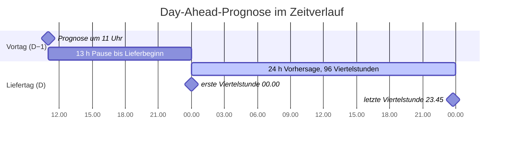

# Meeting mit dem Owner · 2026-10-01

> Datum angenommen (Tag der Protokollierung). Teilnehmende nicht erfasst.

## Kurzfassung

- Es wird eine **Day-Ahead-Prognose** erstellt: Abgabe bis **11:00 am Vortag**, Vorhersage aller **96 Viertelstunden des Folgetags (00:00 bis 23:59)**.
- Für das Modell werden **nur Daten ab 2026-01-01** verwendet, weil vorher eine andere Preisberechnung galt.

## 1. Wann wird die Prognose gemacht?

**Ausgangsfrage:** Zu welchem Zeitpunkt wird die erste Prognose erstellt? Dafür gab es zunächst keine feste Vorgabe.

**Einordnung im Meeting:**

| Prognoseart | Zeitpunkt |
|---|---|
| Day-Ahead | bis **11:00 am Vortag** |
| Intraday | laufend während des Liefertags |

**Festlegung für das Projekt:** Die Prognose wird im Day-Ahead-Fenster gemacht.

*Das Datum im Diagramm ist ein Platzhalter, es zählen nur die Uhrzeiten.*

| Grösse | Wert |
|---|---|
| Prognosezeitpunkt | D−1, 11:00 |
| Vorhersagefenster | D, 00:00 bis 23:59 |
| Auflösung | 15 Minuten, also 96 Werte pro Tag |
| Vorlauf zur ersten Viertelstunde | 13 h |
| Vorlauf zur letzten Viertelstunde (Start 23:45) | 36 h 45 min |

**Hintergrund zu 11:00 (Recherche nach dem Meeting):** Die Schweizer Day-Ahead-Auktion bei EPEX SPOT schliesst täglich um 11:00 (CET/CEST), die Resultate werden ab 11:10 publiziert. Die Schweiz ist nicht an die europäische Marktkopplung (SDAC, Schluss 12:00) angeschlossen. Quelle: EPEX SPOT, Trading Brochure.

## 2. Datenbasis

**Festlegung:** Nur Daten **ab 2026-01-01** verwenden.

**Begründung:** Bis 2025-12-31 galt das Zweipreissystem (GBGR v2.6), seit 2026-01-01 gilt das Einpreissystem mit Knappheitskomponente (GBGR v3.2, Ziffer 7.1). Ältere Preise messen eine andere Zielgrösse.

## Folgen für die Umsetzung

*Eigene Ableitung nach dem Meeting, nicht im Meeting besprochen.*

1. **Kein Datenleck:** Als Feature ist nur erlaubt, was am Vortag um 11:00 bereits bekannt ist. Die provisorische Systembilanz (TSI) erscheint mit rund 30 Minuten Verzug, die letzte nutzbare Viertelstunde liegt also ungefähr bei D−1, 10:15 bis 10:30. Finale Preise kommen erst bis zum 15. Arbeitstag des Folgemonats.
2. **Der Schweizer Day-Ahead-Spotpreis des Liefertags ist um 11:00 noch nicht bekannt.** Die Auktion schliesst genau dann, Resultate gibt es ab 11:10. Er darf höchstens als eigene Prognose in das Modell.
3. **Wenig Daten:** Ab 2026-01-01 liegen rund 9 Monate vor. Ein voller Jahreszyklus (Herbst, Winter) fehlt, und Feiertagseffekte sind nur mit wenigen Fällen belegbar.
4. **Validierung:** Der Test muss den echten Ablauf nachbilden: pro Tag einmal um 11:00 mit dem damaligen Wissensstand prognostizieren (rollierender Backtest), kein zufälliger Split.

## Offene Punkte

| # | Frage | An wen |
|---|---|---|
| 1 | Zeitzone: Schweizer Lokalzeit inklusive Sommerzeit (Tage mit 92 bzw. 100 Viertelstunden)? | Owner |
| 2 | Gehört eine Intraday-Prognose auch zum Auftrag, oder nur Day-Ahead? | Owner |
| 3 | Was wird vorhergesagt: nur der Preis, oder auch die Systemrichtung (short/long) separat? | Team, danach Owner |
