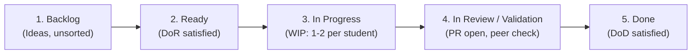
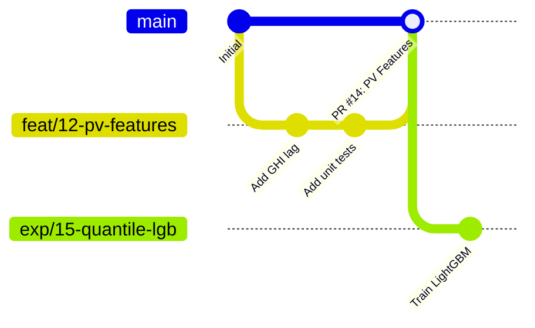

# Project Management &amp; Kanban Workflow

This document defines the team collaboration agreements, Kanban board structure, quality gates, and Git workflows for the **3 Data Science students** working on the Swissgrid Balance Energy Price Prediction Challenge.

---

## 1. Kanban Board Structure &amp; WIP Limits

We manage our project using a GitHub Project board in a Kanban style. The board consists of 5 columns with explicit transition rules:

### Columns &amp; Rules

| Column                        | Purpose                                                                               | Rules &amp; WIP Limits                                                                                      |
| ----------------------------- | ------------------------------------------------------------------------------------- | ----------------------------------------------------------------------------------------------------------- |
| **1. Backlog**                | Reservoir of all ideas, proposed experiments, research topics, and technical chores.  | Unranked or ranked by priority. No WIP limit. Needs grooming into "Ready".                                  |
| **2. Ready**                  | Prioritized items that meet the **Definition of Ready (DoR)**. Ready to be pulled.    | Sorted top-to-bottom by urgency. Target buffer: 3–6 issues.                                                 |
| **3. In Progress**            | Actively being developed, researched, or trained.                                     | **Strict WIP Limit: Max 1–2 active cards per student (Total 3–5 items team-wide).** Finish before starting! |
| **4. In Review / Validation** | Pull Request open, test suite running, or model experiment awaiting team peer review. | Review turnaround target: &lt; 24 hours by one other team member.                                           |
| **5. Done**                   | Completed, merged into `main`, verified against the **Definition of Done (DoD)**.     | Closed issues and merged PRs.                                                                               |

---

## 2. Definition of Ready (DoR)

An issue can only be moved from **Backlog** to **Ready** when:

1. **Clear Objective:** The hypothesis or goal is clearly stated (e.g. "Evaluate whether lag 96 of CAB reduces MAE on price spikes").
2. **Data Availability Verified:** For features or models, verified that input sources comply with the **D−1 11:00 cutoff** (Swissgrid $\le$ D−2 24:00, ECMWF $\le$ D−2 18 UTC).
3. **Acceptance Criteria Defined:** Clear checklist of what must be true for the task to be marked complete.
4. **Estimated Scope:** Small enough to be completed within 2–4 days. Larger topics are broken down into sub-issues.
5. **Assignee Assigned:** One student takes primary ownership.

---

## 3. Definition of Done (DoD)

An item is considered **Done** and merged into `main` only when:

1. **Code &amp; Test Quality:**
   - Code adheres to Python PEP 8 standards and is properly typed.
   - All unit tests pass locally via `make test`.
   - New transformations or pipeline components have corresponding unit tests in `tests/`.
2. **Zero Data Leakage:**
   - Features use only information strictly published before D−1 11:00.
   - Any scaling or transformations are fit *inside* cross-validation splits (no leakage into test folds).
3. **Reproducibility:**
   - Random seeds (Python `random`, `numpy`, `torch`, `lightgbm`, etc.) are explicitly configured.
   - Environment is pinned with `requirements.lock`.
4. **Uncertainty Quantification (for Models):**
   - Model outputs both point predictions and uncertainty intervals / quantiles as required by the challenge.
   - Metrics are recorded with uncertainty evaluation (e.g., coverage %, pinball loss).
5. **Peer Review:**
   - Pull Request reviewed and approved by at least **one other team member**.
6. **Documentation &amp; Traceability:**
   - Key findings summarized in the PR or relevant docs (`docs/overview.md` or `docs/data.md`).
   - Linked issue is referenced (`Closes #123`) and automatically closed.
   - *Note:* Do not create or update `STATUS.md`.

---

## 4. Branching Strategy &amp; Git Hygiene

We follow a GitHub Flow branch model:

### Branch Naming Conventions

- `feat/<issue-id>-<short-description>`: New feature transformers, pipeline stages, or preprocessing.
- `exp/<issue-id>-<short-description>`: Model training experiments, hyperparameter tuning, or benchmarking.
- `eda/<issue-id>-<short-description>`: Data analysis, statistical profiling, distribution checks.
- `fix/<issue-id>-<short-description>`: Bug fixes in data fetch, pipelines, or tests.
- `docs/<issue-id>-<short-description>`: Updates to project documentation, diagrams, or presentations.

### Commit Messages

Follow conventional, descriptive commit messages:

- `feat: add 48h rolling average of Swissgrid CAB`
- `exp: benchmark quantile LightGBM against naive persistence baseline`
- `fix: correct timezone conversion in ECMWF weather parser`
- `test: add unit test for D-1 11:00 cutoff boundary`
- `docs: update data documentation with canton PV capacity methodology`

---

## 5. GitHub Label Taxonomy

Labels keep the Kanban board readable and filterable.

| Category     | Label                  | Color     | Purpose                                           |
| ------------ | ---------------------- | --------- | ------------------------------------------------- |
| **Type**     | `type: eda`            | `#0E8A16` | Exploratory Data Analysis &amp; Data Quality      |
|              | `type: feature`        | `#1D76DB` | Feature engineering or pipeline transformation    |
|              | `type: experiment`     | `#5319E7` | Model experiment, tuning, or benchmarking         |
|              | `type: bug`            | `#D93F0B` | Pipeline error, broken fetch, or test failure     |
|              | `type: task`           | `#006B75` | General engineering task, CI/CD, or maintenance   |
|              | `type: docs`           | `#0075CA` | Documentation, wiki, or presentation slides       |
| **Area**     | `area: data`           | `#BFDADC` | Raw data, downloads, storage, and ingestion       |
|              | `area: features`       | `#C2E0C6` | Feature engineering and data transformations      |
|              | `area: modeling`       | `#D4C5F9` | Model architecture, loss functions, uncertainty   |
|              | `area: eval`           | `#FEF2C0` | Metrics, cross-validation, benchmarking           |
|              | `area: infra`          | `#F9D0C4` | Makefile, environments, tests, dependencies       |
| **Priority** | `prio: p0-urgent`      | `#B60205` | Blocks the team or critical milestone             |
|              | `prio: p1-high`        | `#E99695` | High priority for current milestone               |
|              | `prio: p2-medium`      | `#FBCA04` | Normal priority                                   |
|              | `prio: p3-low`         | `#FEF2C0` | Nice-to-have / backlog refinement                 |
| **Status**   | `status: blocked`      | `#6A0DAD` | Blocked by external dependency or another issue   |
|              | `status: needs-review` | `#FBCA04` | PR is waiting on teammate review                  |
|              | `status: needs-run`    | `#C5DEF5` | Awaiting long-running computation or data rebuild |
