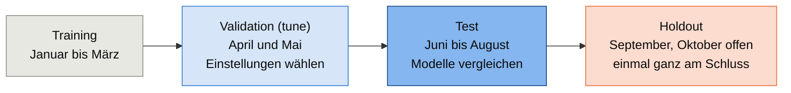
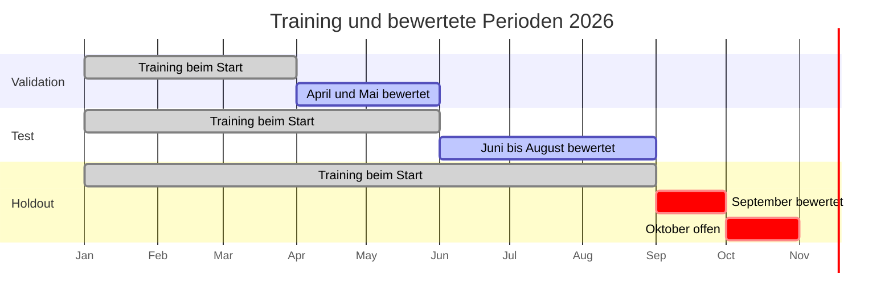

# Trainingspipeline

```mermaid
flowchart LR
    TRAIN["Training<br/>Januar bis März"]
    VAL["Validation (tune)<br/>April und Mai<br/>Einstellungen wählen"]
    TEST["Test<br/>Juni bis August<br/>Modelle vergleichen"]
    HOLD["Holdout<br/>September, Oktober offen<br/>einmal ganz am Schluss"]

    TRAIN --> VAL --> TEST --> HOLD

    classDef train fill:#e8e8e3,stroke:#8a8983,color:#0b0b0b
    classDef val fill:#d6e6f8,stroke:#2a78d6,color:#0b0b0b
    classDef test fill:#86b6ef,stroke:#104281,color:#0b0b0b
    classDef hold fill:#fbdccf,stroke:#eb6834,color:#0b0b0b
    class TRAIN train
    class VAL val
    class TEST test
    class HOLD hold
```

```mermaid
gantt
    title Training und bewertete Perioden 2026
    dateFormat YYYY-MM-DD
    axisFormat %b
    tickInterval 1month

    section Validation
    Training beim Start      :done, 2026-01-01, 2026-04-01
    April und Mai bewertet   :active, 2026-04-01, 2026-06-01

    section Test
    Training beim Start      :done, 2026-01-01, 2026-06-01
    Juni bis August bewertet :active, 2026-06-01, 2026-09-01

    section Holdout
    Training beim Start      :done, 2026-01-01, 2026-09-01
    September bewertet       :crit, 2026-09-01, 2026-10-01
    Oktober offen            :crit, 2026-10-01, 2026-11-01
```

Das Training wächst wöchentlich mit und nutzt für den Liefertag D nur Preise bis D−2.
